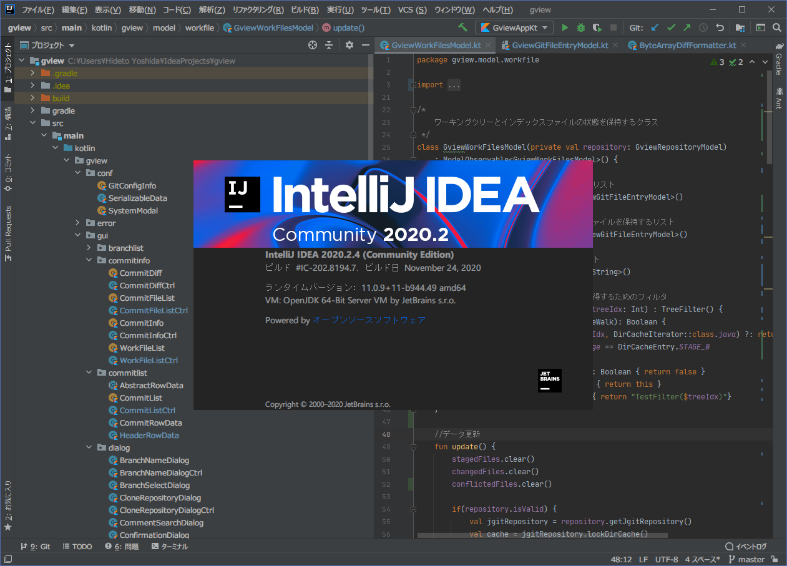
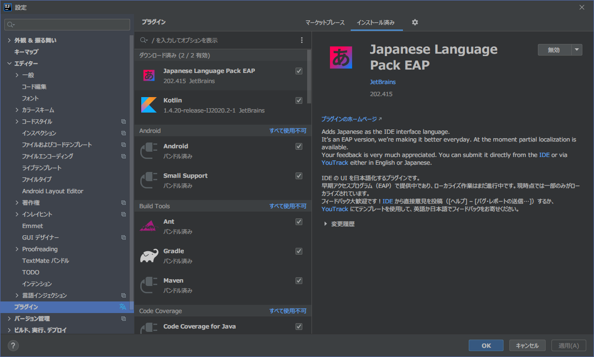

For the development of *gview*, I decided to use [Kotlin](https://kotlinlang.org/) as the programming language.

Kotlin is one of the JVM languages in general terms, and is interoperable with Java.
Since I plan to use JGit, a library written in Pure Java, as my Git library, compatibility with Java was a must.
I chose Kotlin because of my personal interest in using the language, that is getting a lot of attention in Android development and other fields.

There are several ways to develop programs in Kotlin, but I think the easiest and quickest way is to use [IntelliJ/IDEA](https://www.jetbrains.com/ja-jp/idea/).
The reasons are that the language and developer (JetBrain) are the same, so you can expect the best support, and that the IDE itself has a good reputation.
The free version (Community Edition), which can be used for personal and open source development, is also an advantage.

### Download and Install

You can download it from [here](https://www.jetbrains.com/ja-jp/idea/download/).
The installation procedure is different for each OS, but I don't think there are any difficult steps.

{}[This page](https://pleiades.io/help/idea/installation-guide.html) explains the installation procedure in detail.  
There are many more if you look for them.{}

### Plug-ins (for Japanese)

If you want to use it in Japanese, you used to need a separate plugin (pleiades).
Recently, a genuine [Japanese plugin](https://plugins.jetbrains.com/plugin/13964-japanese-language-pack-eap) has become available, and it is useful to install it.

In addition, install the [Kotlin plugin](https://plugins.jetbrains.com/plugin/6954-kotlin).
Depending on the version of IDEA you downloaded, it may have been installed from the beginning.

Other than that, I used the plug-ins bundled by default.
The plugin settings screen (File > Settings and select Plugins) now looks like the following figure.

