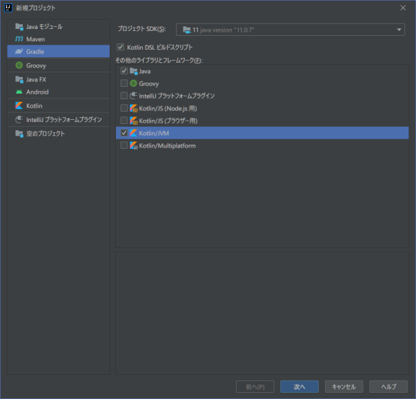
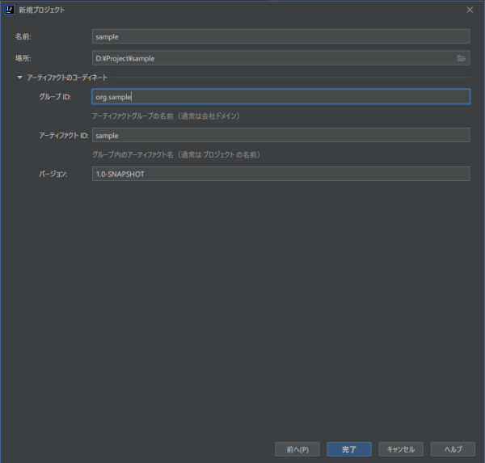
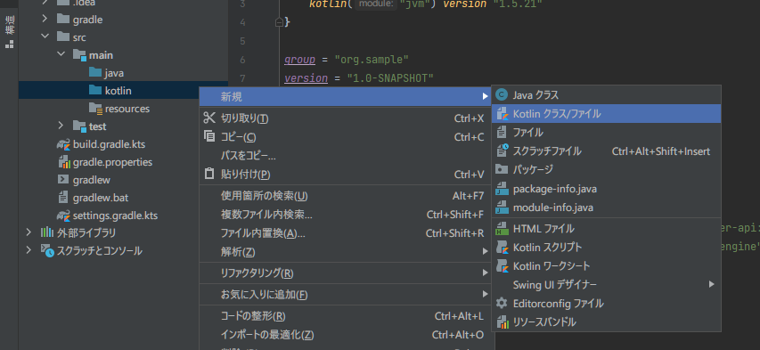
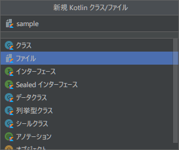
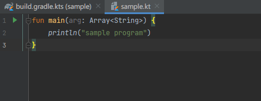

Once the installation of the IDE is complete, the first step is to create a project.

### Create New Project

In developing gview, I decided to create a project to manage dependencies in [Gradle](https://gradle.org/).

First of all, invoke the "New Project" dialog in the New Project menu ([File]→[New]→[Project], etc.).
In the "Other libraries and frameworks" section, select "Java" and "kotlin/jvm".

{}Note that if you don't select Java here, it seems that it won't create a folder under `src/`.{}

I write the "DSL build script" in kotlin as well.

<div style="clear:both;"></div>

Click "Next," enter a suitable name, etc., and click "Finish" to generate the first project.  

<div style="clear:both;"></div>

### Generated Project

The directory structure of the generated project should look like the following:
<blockquote><pre>
    sample/
    ├── build.gradle.kts
    ├── gradle
    │   └── wrapper
    │       ├── gradle-wrapper.jar
    │       └── gradle-wrapper.properties
    ├── gradle.properties
    ├── gradlew
    ├── gradlew.bat
    ├── settings.gradle.kts
    └── src
        ├── main
        │   ├── java
        │   ├── kotlin
        │   └── resources
        └── test
            ├── java
            ├── kotlin
            └── resources
</pre></blockquote>

Write some simple code to see the project structure.
First, create a kotlin source file under *src/main/kotlin* using [New] -> [kotlin class/file]:

<div style="clear:both;"></div>

Specify any file name to generate the source file:  


<div style="clear:both;"></div>
<br/>

Run it from the "Run" menu, and you should see the message. 
```
sample program
```