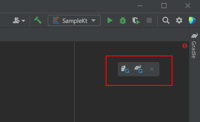
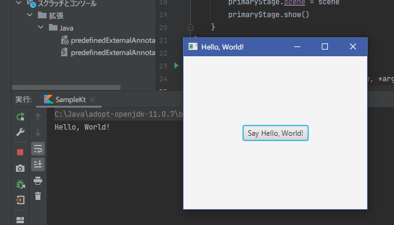

This section describes to set up packages, etc. to use JavaFX classes in our project.

### Setting up Gradle

The project created in the previous chapter uses [gradle](https://gradle.org/), so we will add definitions to use JavaFX via gradle.
The file that needs to be configured is *build.gradle.kts*, which is located directly under the project.

First, add the following statements to introduce the JavaFX Plug-in/[JavaFX Gradle PlugIn](https://github.com/openjfx/javafx-gradle-plugin). 

```kotlin
plugins {
    id("org.openjfx.javafxplugin") version "0.0.9"
}
javafx {
    version = "11.0.2"
    modules = listOf("javafx.controls","javafx.fxml")
}
```

You will see the following icon, and run "Load Gradle changes":


If it finishes without error, you are ready to go.

The contents of the updated *build.gradle.kts* file looks like the one below:
{}There may be some differences depending on the version of the IDE you use.{}

```kotlin
plugins {
    java
    kotlin("jvm") version "1.5.21"
    id("org.openjfx.javafxplugin") version "0.0.9"
}

group = "org.sample"
version = "1.0-SNAPSHOT"

repositories {
    mavenCentral()
}

dependencies {
    implementation(kotlin("stdlib"))
    testImplementation("org.junit.jupiter:junit-jupiter-api:5.6.0")
    testRuntimeOnly("org.junit.jupiter:junit-jupiter-engine")
}

javafx {
    version = "11.0.2"
    modules = listOf("javafx.controls","javafx.fxml")
}

tasks.getByName<Test>("test") {
    useJUnitPlatform()
}
```

### Sample Program - hello, world

Now we are ready to use JavaFX, so let's make a small example to see how it works.  

Rewrite the *sample.kt* file created in [Generated Project]( "Generated Project") as follows:
{}If you are unable to import *javafx* related classes, please recheck your gradle settings.{}

```kotlin
import javafx.application.Application
import javafx.event.EventHandler
import javafx.scene.Scene
import javafx.scene.control.Button
import javafx.scene.layout.StackPane
import javafx.stage.Stage

class Sample: Application() {
	override fun start(primaryStage: Stage) {
		val greet = "Hello, World!"
		val btn = Button()
		btn.text = "Say $greet"
		btn.onAction = EventHandler { println(greet) }
		val root = StackPane()
		root.children.add(btn)
		val scene = Scene(root, 300.0, 250.0)
		primaryStage.title = greet
		primaryStage.scene = scene
		primaryStage.show()
	}
}

fun main(args: Array<String>) {
	Application.launch(Sample::class.java, *args)
}
```

Once executed, you should see a screen like the following:


