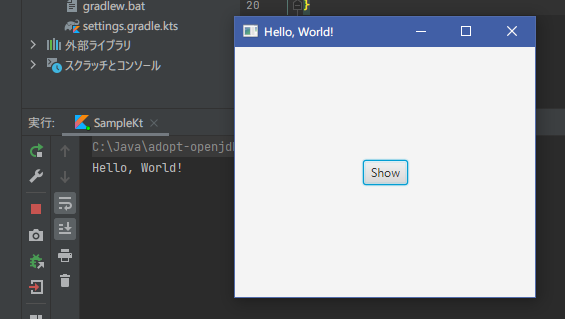

In the sample program shown in [Basic Settings]( "Basic Settings"), the view configuration was written in Java (actually in Kotlin).  
This is fine for a simple screen like "Hello, World", but when actually developing a program, it is easier to separate the definition of complex screen structures from the processing code.

As a feature for this purpose, JavaFX allows the UI to be described in an XML file (FXML).  
For detailed explanation, please refer to [this tutorial](https://docs.oracle.com/javase/jp/8/javafx/get-started-tutorial/fxml_tutorial.htm). I would like to introduce a simple example program here.

First, create an FXML file "*Hello.fxml*" as shown below and place it under the *resources/* folder:

```kotlin
<?xml version="1.0" encoding="UTF-8"?>

<?import javafx.scene.control.*?>
<?import javafx.scene.layout.*?>

<BorderPane xmlns="http://javafx.com/javafx/11.0.2"
            xmlns:fx="http://javafx.com/fxml/1"
            fx:controller="Hello">
    <center>
        <Button fx:id="greetButton" />
    </center>
</BorderPane>
```

The class specified by "*fx:controller*" here becomes the controller for this UI.
Write the following class. The member variable "*greetButton*" corresponds to the button defined in the FXML &lt;*Button*&gt; tag.

```kotlin
import javafx.fxml.FXML
import javafx.scene.control.Button

class Hello {
	@FXML private lateinit var greetButton: Button

	fun initialize() {
		greetButton.text = "Show"
		greetButton.setOnAction { _ -> println("Hello, World!") }
	}
}
```
The view and controller are now complete.
Change the description of *Sample* in the sample program of [Basic Settings]( "Basic Settings") section to use this one:

```kotlin
import javafx.application.Application
import javafx.fxml.FXMLLoader
import javafx.scene.Parent
import javafx.scene.Scene
import javafx.stage.Stage

class Sample: Application() {

	override fun start(primaryStage: Stage) {
		val loader = FXMLLoader(javaClass.getResource("/Hello.fxml"))
		val root = loader.load() as Parent
		primaryStage.title = "Hello, World!"
		primaryStage.scene = Scene(root, 300.0, 250.0)
		primaryStage.show()
	}
}

fun main(args: Array<String>) {
	Application.launch(Sample::class.java, *args)
}
```

Once executed, you will see a screen like the following:

