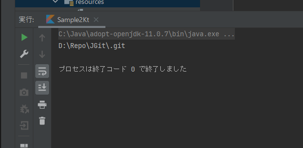

The first step is to configure JGit for use, download the artifacts, etc.

### Configuring Gradle

As with JavaFX, we use [gradle](https://gradle.org/) to get the library from the [Maven Repository](https://mvnrepository.com/artifact/org.eclipse.jgit/org.eclipse.jgit).

[Create New Project]( "Create New Project") as you did for JavaFx, and add the following line to *dependencies* of *build.gradle.kts*:

```kotlin
dependencies {
    implementation("org.eclipse.jgit:org.eclipse.jgit:5.12.0.202106070339-r")
}
```

JGit uses [SLF4J](https://mvnrepository.com/artifact/org.slf4j/slf4j-log4j12) as the log framework, so add this as well:

```kotlin
dependencies {
    implementation("org.slf4j:slf4j-log4j12:1.7.32")
}
```

For both, please choose the appropriate one from the respective links for the version.

Once you run the Gradle update, the JGit library will be downloaded and ready to use in your program.

### The First Program

<a name="Sample"></a>Now that we are ready, let's write a simple program to see how it works.

In the *main* function of your project (which in our example will be *sample.ks*), write the following code to clone the repository, and change *remotePath* and *locakPath* to something appropriate:

```kotlin
import org.eclipse.jgit.api.Git
import java.io.File

fun main(args: Array<String>) {

	val remotePath = "https://git.eclipse.org/r/jgit/jgit.git"
	val localPath  = "D:\\Repo\\JGit"

	val git = Git.cloneRepository()
		.setURI(remotePath)
		.setDirectory(File(localPath))
		.setBare(false)
		.call()
	println(git.repository.directory)
}
```
Before we build and run the program, we need to configure log4j.
Temporarily place the following files under *main/resources*:

```kotlin
log4j.rootLogger=ERROR, console

log4j.appender.console=org.apache.log4j.ConsoleAppender
log4j.appender.console.layout=org.apache.log4j.PatternLayout
log4j.appender.console.layout.ConversionPattern=%d [%-5p-%c] %m%n
```

Build and run it, and the repository should be cloned into your local directory.

