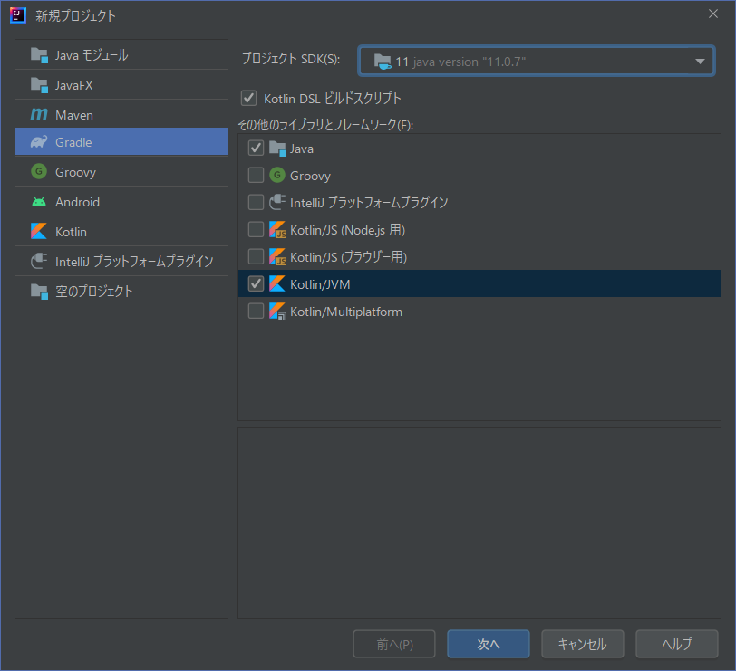
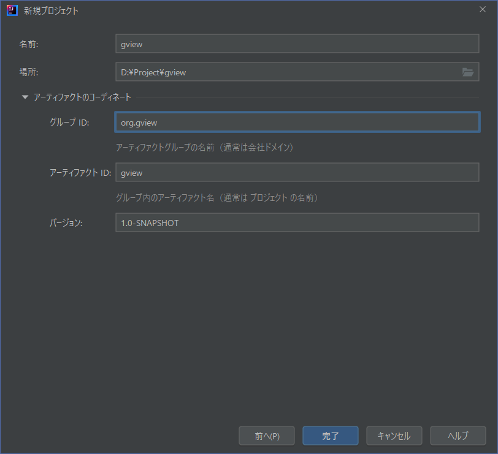

The first step is to create a project.
We will combine all the previous explanations into one to define a project that can use JGit and JavaFX together.

The sample program shows it briefly, but this time I will follow the steps and write it down.

First of all, use the "File"->"New"->"Project" menu to bring up the Create New Project dialog:


Select "kotlin/jvm" and proceed with "Next":


Enter the name and other information as appropriate, and select "Finish".

After a while, a project tree will be generated with *src* directories and so on.

After that, we will open the *build.gradle.ks* file and add the necessary definitions. First, we will define the use of JavaFX:
```kotlin
plugins {
    id("org.openjfx.javafxplugin") version "0.0.9"
}
javafx {
    version = "11.0.2"
    modules = listOf("javafx.controls","javafx.fxml")
}
```

The definition of JGit will also be added:
```kotlin
dependencies {
    // JGit
    implementation("org.eclipse.jgit:org.eclipse.jgit:5.9.0.202009080501-r")
    // SLF4J/Log4J
    implementation("org.slf4j:slf4j-log4j12:1.7.32")
}
```

Once built, the necessary libraries will be obtained and configured, and we are ready to start programming.

The final contents of the *build.gradle.ks* file should now look like this.
Now, you can create a program that uses JavaFX and JGit from your kotlin code:  
(The components that are not explained will be explained later.)

```kotlin
plugins {
    kotlin("jvm") version "1.6.10"
    kotlin("plugin.serialization") version "1.6.10"
    id("org.openjfx.javafxplugin") version "0.0.9"
}

group = "gview"
version = "Proto-1"

repositories { mavenCentral() }

dependencies {
    // Use the Kotlin JDK standard library.
    implementation(kotlin("stdlib"))
    implementation("org.jetbrains.kotlinx:kotlinx-serialization-json:1.3.1")
    // JGit
    implementation("org.eclipse.jgit:org.eclipse.jgit:5.9.0.202009080501-r")
    // SLF4J/Log4J
    implementation("org.slf4j:slf4j-log4j12:1.7.32")
    // Ikonli
    implementation("org.kordamp.ikonli:ikonli-javafx:12.2.0")
    implementation("org.kordamp.ikonli:ikonli-materialdesign-pack:12.2.0")
    //ControlFX
    implementation("org.controlsfx:controlsfx:11.1.1")
}

// JavaFX PlugIn
javafx {
    version = "11.0.2"
    modules = listOf("javafx.controls","javafx.fxml")
}

tasks {
    compileKotlin {
        kotlinOptions.jvmTarget = "1.8"
    }
    compileTestKotlin {
        kotlinOptions.jvmTarget = "1.8"
    }
}
```
