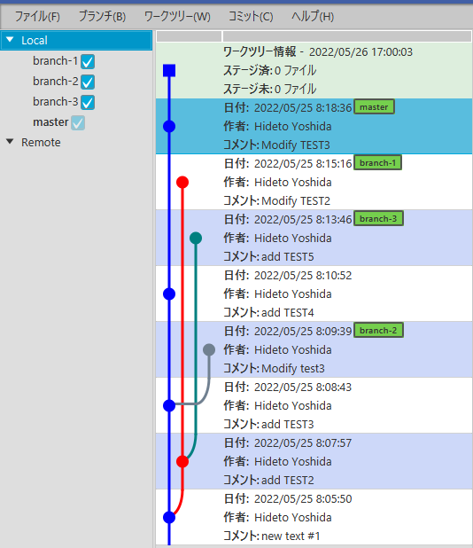
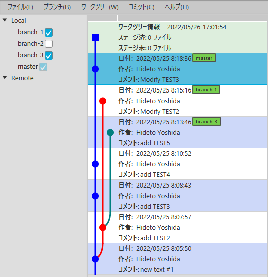
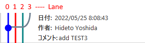

We keep lists of commits in the repository model.

### Obtaining a list of commit information

We used [*Git*](https://javadoc.io/doc/org.eclipse.jgit/org.eclipse.jgit/5.9.0.202009080501-r/org/eclipse/jgit/api/Git.html), a high-level class of JGit, to create repositories and retrieve branch information.
However, we need more detailed information about the commit, so we process it at a lower level.
JGit has a class called [*PlotWalk*](https://javadoc.io/static/org.eclipse.jgit/org.eclipse.jgit/5.9.0.202009080501-r/org/eclipse/jgit/revplot/PlotWalk.html), which can retrieve not only information about commits, but also information for drawing a commit graph.

First, we create an instance of *PlotWalk*.
The parameter is the Repository to which the information refers.

```kotlin
    val plotWalk = PlotWalk(repository)
```

Next, we specify the commit to initiate graph traversal.
The starting position is an instance or collection of [*RevCommit*](https://javadoc.io/static/org.eclipse.jgit/org.eclipse.jgit/5.9.0.202009080501-r/org/eclipse/jgit/revwalk/RevCommit.html). This is obtained using the *parseCommit(AnyObjId)* method, for example.

For example, if you want to start the graph from "HEAD", you can use the constant `HEAD` and the methods of *Repository* to get the *ObjId*.
```kotlin
    val headId = repository.resolve(Constants.HEAD)
    plotWalk.markStart(plotWalk.parseCommit(headId))
```

To actually retrieve the commit information, we use the collection class called [*PlotCommitList*](https://javadoc.io/static/org.eclipse.jgit/org.eclipse.jgit/5.9.0.202009080501-r/org/eclipse/jgit/revplot/PlotCommitList.html).
After setting the *PlotWalk* using the *source()* method, call *fillTo()* to get the elements.

```kotlin
    val plotCommitList = PlotCommitList<PlotLane>()
    plotCommitList.source(plotWalk)
    plotCommitList.fillTo(commitSize)
```

*commitSize* specifies the maximum number of commits to retrieve.
We can get the commit information *PlotCommit<PlotLane>* from *PlotCommitList*.

After all information has been retrieved, `plotWalk` must be closed.
As the *PlotWalk* class implements *AutoClose* interface, you can also use Kotlin's *use* function.

Gview allows you to choose to show/hide each branch, which is achieved by setting *markStart()*  explained earlier.
This is achieved by setting the ID of the branch to be displayed (check box is ON) as the target of traversal.

```kotlin
    val plotWalk = PlotWalk(repository.jgitRepository)
    val plotCommitList = PlotCommitList<PlotLane>()
    plotWalk.use {
        repository.branches.localBranchList.value
            .filter { it.selectedFlagProperty.value }
            .forEach { plotWalk.markStart(plotWalk.parseCommit(it.ref.objectId)) }
        plotCommitList.source(plotWalk)
        plotCommitList.fillTo(this.commitSize)
    }
```

For example, in the following repository, 

<br/>

if you exclude "branch-2" from the display list, the tree view will be as follows.



### Commit information

The commit information in the retrieved list includes information about the commit operation (author, date, comments, etc.) as well as information for drawing a commit graph (tree diagram).

#### Commit graph

From *PlotCommit\<PlotLane\>* retrieved using *PlotWalk*,  we can obtain the information to draw the commit graph.
The committed graph information represented by *PlotLane* uses "lanes", which are integer values starting from 0.
The leftmost point of the graph is lane 0.

In the figure below, lanes 0-3 are defined for the commit.



We Draw a commit graph using the following information of each commit
1. Lane number (`laneNumber`) of the commit. This is the lane indicated by ● in the above figure. In that figure, it is lane 0.
The lane number is referenced from the field *position* of *PlotLane*.

2. Lane numbers to pass through (`passThroughLanes`). Lanes 1 and 2 in the above figure are represented by straight lines that pass through because they are the lanes that connect before and after this commit.
This information can be retrieved with the method *findPassingThrough(commit,result)* of *PlotCommitList\<PlotLane\>*.
    ```kotlin
    val passThroughLanes : MutableList<Int> by lazy {
        val result = mutableSetOf<PlotLane>()
        commitList.plotCommitList.findPassingThrough(thisCommit, result)
        result.map { it.position }.sorted().distinct().toMutableList()
    }
    ```
3. Lane numbers that reach this commit (`enteringLanes`). 
We take them from the information of the parent of the commit (`parents`).
If the commit is not a merge commit (the number of `parents` is 1), we use the commit's own lane number.
If it is a merge commit, we add the lane number of the commit from which it was merged.
    ```kotlin
    val enteringLanes : List<Int> by lazy {
        if(thisCommit.parentCount > 1) {
            ( parents.map { it.laneNumber } ).plus( laneNumber ).distinct()
        } else {
            listOf( laneNumber )
        }
    }
    ```
4. Lane numbers coming out of this commit (`exitingLanes`). It is obtained using `enteringLanes`.
The sum of `passThroughLanes` and `enteringLanes` of the next  commit minus `passThroughLanes` of this commit is the lanes coming out of this commit.
    ```kotlin
    val exitingLanes: MutableList<Int> by lazy {
        (prevCommit?.enteringLanes?.plus(prevCommit.passThroughLanes)?.minus(passThroughLanes.toSet())
            ?: emptyList()).toMutableList()
    }
    ```

#### Commit information class

I implemented a commit information class with *PlotCommit\<PlotLane\>* obtained from the commit information list and the aforementioned commit graph information.
It has the following parameters in the constructor and creates a list that can be referenced bidirectionally.

```kotlin
class GvCommit(private val repo: Repository,
               private val thisCommit: PlotCommit<PlotLane>,
               private val commitList: GvCommitList,
               private val prevCommit: GvCommit?) {
    private var nextCommit: GvCommit? = null
    init {
        prevCommit?.nextCommit = this
    }
```

We create a list of this commit information class from the *PlotCommitList<PlotLane>* we already have generated.

```kotlin
        val commits = mutableListOf<GvCommit>()
        var prev: GvCommit? = null
        plotCommitList.forEach {
            val commit = GvCommit(repository.jgitRepository, it, this, prev)
            commits.add( commit )
            prev = commit
        }
```

Now that the commit information has been obtained.