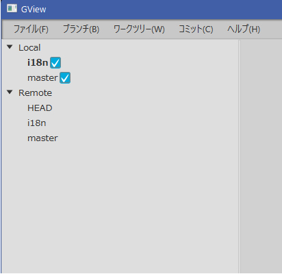

BranchList is implemented in a *TreeView* with two routes, "Local" and "Remote".

<br/>

We use the common classes introduced in the WindowBasicClass to implement them.

### Basic Structure and FXML

First, we define the view in FXML. It has a simple structure with one *TreeView*.

<?xml version="1.0" encoding="UTF-8"?>

<?import javafx.scene.control.TreeView?>
<?import javafx.scene.layout.AnchorPane?>

<TreeView fx:id="branchTree"
          xmlns="http://javafx.com/javafx/10.0.2" xmlns:fx="http://javafx.com/fxml/1"
          AnchorPane.bottomAnchor="0.0" AnchorPane.topAnchor="0.0"
          AnchorPane.leftAnchor="0.0" AnchorPane.rightAnchor="0.0"
          stylesheets="@/Gview.css" fx:controller="gview.view.branchlist.BranchListCtrl" />


### Window Class

I defined a view class *BranchList* as a singleton　that references fxml file.  
The second parameter of the constructor is used as the class name when referencing the CSS definition.

package gview.view.branchlist

import gview.view.framework.GvBaseWindow

object BranchList: GvBaseWindow<BranchListCtrl>("/view/BranchListView.fxml", "BranchList")


### Control Class

The control class defines member variables for components defined in the FXML file.  
Only one instance of *TreeView* is defined in this class.

```kotlin
class BranchListCtrl: GvBaseWindowCtrl() {
    @FXML private lateinit var branchTree: TreeView<GvBranch>

    private var localTreeRoot = RootItem("Local")
    private var remoteTreeRoot = RootItem("Remote")
```

`localTreeRoot` and `remoteTreeRoot` are members that hold the root elements of the local and remote branch trees, respectively, and are instances of the *RootItem* class.

The *RootItem* class is an implementation of the abstract class *BranchTreeItem*, which inherits from *TreeItem*, an element class of *TreeView* in JavaFX, as follows:

```kotlin
    abstract class BranchTreeItem(model: GvBranch?) : TreeItem<GvBranch>(model) {
        abstract val cellImage: Node
        abstract val contextMenu: ContextMenu?
        abstract override fun isLeaf(): Boolean
    }

    class RootItem(name: String) : BranchTreeItem(null) {
        override val cellImage: Node = Label(name)
        override val contextMenu: ContextMenu? = null
        override fun isLeaf(): Boolean = false
        init { isExpanded = true }
    }
```

In addition to implementing the abstract method `isLeaf()` of *TreeItem*, *BranchTreeItem* has two abstract properties: `cellImage`, which holds the image of drawing on a cell, and `contextmenu`, which returns the context to be displayed when right-clicked.

The *RootItem* class is not a leaf, so `isLeaf()` returns `false`.
`contextMenu` is `null` as it is not used, and `cellImage` returns a simple label that displays the name of the branch.

Initialization method is implemented as the `initialize()` method according to JavaFX conventions.

At first, we declare an element that will be the root of the entire `TreeView`, and register `localTreeRoot` and `remoteTreeRoot` as its children. The root element is not shown as `isShowRoot` property is set to `false`.

```kotlin
    fun initialize() {
        val root = RootItem("Branch Root" )
        root.children.setAll(localTreeRoot, remoteTreeRoot)
```
The next step is to initialize the `TreeView`.
After setting the route and CellFactory,  clear the item selection and set CSS styles.

```kotlin
        branchTree.root = root
        branchTree.isShowRoot = false
        branchTree.setCellFactory { BranchTreeCell() }
        branchTree.selectionModel.clearSelection()
        branchTree.style = Style.treeStyle
```

The class *BranchTreeCell*, used as CellFactory, is an internal class that inherits from JavaFX's *TreeCell* class.
It overrides the *updateItem()* method to refer to the *treeItem* property as *BranchTreeItem* concrete class, to update display and context menu.

```kotlin
    private class BranchTreeCell: TreeCell<GvBranch>() {
        override fun updateItem(model: GvBranch?, empty: Boolean) {
            super.updateItem(model, empty)
            if(!empty) {
                graphic = (treeItem as? BranchTreeItem)?.cellImage
                contextMenu = (treeItem as? BranchTreeItem)?.contextMenu
            } else {
                graphic = null
                contextMenu = null
            }
            text = null
            style = Style.cellStyle
        }
    }
```

In the `initialize()` method, define the processes when the repository is updated and when it loses focus, and set the initial state to hidden (set `false` to `isVisible`).

```kotlin
        GvRepository.currentRepositoryProperty.addListener { _, _, repository
            -> Platform.runLater { updateRepository(repository) }
        }
        branchTree.focusedProperty().addListener { _, _, newValue ->
            if(!newValue) branchTree.selectionModel.clearSelection() }
        branchTree.isVisible = false
    }
```

I decided to have the definitions for styles of *TreeView* and *TreeCell*  as constants in the class as follows.

```kotlin
    private object Style {
        val treeStyle =
            "-fx-padding: 0;"
        val cellStyle =
            "-fx-padding: 2 0;"
    }
```

The last method is `updateRepository()`, which is used to update the repository.
This method, as follows, updates the display of the local and remote branches after defining what to do when the local branch, remote branch, or selected branch is updated:

```kotlin
    private fun updateRepository(repository: GvRepository) {
        val branchList = repository.branches
        branchList.localBranchList.addListener  { _ -> updateLocalBranches (branchList) }
        branchList.remoteBranchList.addListener { _ -> updateRemoteBranches(branchList) }
        branchList.currentBranch.addListener    { _ -> updateLocalBranches (branchList) }
        updateLocalBranches (branchList)
        updateRemoteBranches(branchList)
        branchTree.selectionModel.clearSelection()
    }
```

Local and remote branches are updated by traversing the respective lists and updating the tree elements, as follows:

```kotlin
    private fun updateLocalBranches(branchList: GvBranchList) {
        localTreeRoot.children.clear()
        branchList.localBranchList.value.forEach { 
            localTreeRoot.children.add(LocalBranchItem(it)) }
        branchTree.isVisible = true
    }
    private fun updateRemoteBranches(branchList: GvBranchList) {
        remoteTreeRoot.children.clear()
        branchList.remoteBranchList.value.forEach { 
            remoteTreeRoot.children.add(RemoteBranchItem(it)) }
        branchTree.isVisible = true
    }
```

The *LocalBranchItem* and *RemoteBranchItem* to be added as tree elements are both concrete classes of the aforementioned *BranchTreeItem*.

The final implementation of the control class looked something as follows:

package gview.view.branchlist

import gview.view.framework.GvBaseWindowCtrl
import gview.model.GvRepository
import gview.model.branch.GvBranch
import gview.model.branch.GvBranchList
import javafx.application.Platform
import javafx.fxml.FXML
import javafx.scene.Node
import javafx.scene.control.*

class BranchListCtrl: GvBaseWindowCtrl() {

    @FXML private lateinit var branchTree: TreeView<GvBranch>
    private var localTreeRoot = RootItem("Local")
    private var remoteTreeRoot = RootItem("Remote")

    fun initialize() {
        val root = RootItem("Branch Root" )
        root.children.setAll(localTreeRoot, remoteTreeRoot)

        branchTree.root = root
        branchTree.isShowRoot = false
        branchTree.setCellFactory { BranchTreeCell() }
        branchTree.selectionModel.clearSelection()
        branchTree.style = Style.treeStyle

        GvRepository.currentRepositoryProperty.addListener { _, _, repository
            -> Platform.runLater { updateRepository(repository) }
        }
        branchTree.focusedProperty().addListener { _, _, newValue ->
            if(!newValue) branchTree.selectionModel.clearSelection() }

        branchTree.isVisible = false
    }

    private fun updateRepository(repository: GvRepository) {
        val branchList = repository.branches
        branchList.localBranchList.addListener  { _ -> updateLocalBranches (branchList) }
        branchList.remoteBranchList.addListener { _ -> updateRemoteBranches(branchList) }
        branchList.currentBranch.addListener    { _ -> updateLocalBranches (branchList) }
        updateLocalBranches (branchList)
        updateRemoteBranches(branchList)
        branchTree.selectionModel.clearSelection()
    }

    private class BranchTreeCell: TreeCell<GvBranch>() {

        override fun updateItem(model: GvBranch?, empty: Boolean) {
            super.updateItem(model, empty)
            if(!empty) {
                graphic = (treeItem as? BranchTreeItem)?.cellImage
                contextMenu = (treeItem as? BranchTreeItem)?.contextMenu
            } else {
                graphic = null
                contextMenu = null
            }
            text = null
            style = Style.cellStyle
        }
    }

    private fun updateLocalBranches(branchList: GvBranchList) {
        localTreeRoot.children.clear()
        branchList.localBranchList.value.forEach { localTreeRoot.children.add(LocalBranchItem(it)) }
        branchTree.isVisible = true
    }

    private fun updateRemoteBranches(branchList: GvBranchList) {
        remoteTreeRoot.children.clear()
        branchList.remoteBranchList.value.forEach { remoteTreeRoot.children.add(RemoteBranchItem(it)) }
        branchTree.isVisible = true
    }

    abstract class BranchTreeItem(model: GvBranch?) : TreeItem<GvBranch>(model) {
        abstract val cellImage: Node
        abstract val contextMenu: ContextMenu?
        abstract override fun isLeaf(): Boolean
    }

    class RootItem(name: String) : BranchTreeItem(null) {
        override val cellImage: Node = Label(name)
        override val contextMenu: ContextMenu? = null
        override fun isLeaf(): Boolean = false
        init { isExpanded = true }
    }

    private object Style {
        val treeStyle =
            "-fx-padding: 0;"
        val cellStyle =
            "-fx-padding: 2 0;"
    }
}


### RemoteBranchItem

*RemoteBranchItem* holds remote branch information.
It is almost identical to *RootItem*, having only the branch name as a label.

package gview.view.branchlist

import gview.view.menu.RemoteBranchContextMenu
import gview.model.branch.GvRemoteBranch
import javafx.scene.control.ContextMenu
import javafx.scene.control.Label

class RemoteBranchItem(val model: GvRemoteBranch) : BranchListCtrl.BranchTreeItem(model) {
    override val cellImage = Label(model.name)
    override fun isLeaf(): Boolean = true
    override val contextMenu: ContextMenu? get()  { return RemoteBranchContextMenu(model) }
}


### LocalBranchItem

The *LocalBranchItem*, which holds local branch information, has a checkbox to select whether or not the corresponding branch should be included in the tree view, in addition to the branch name.

As a first step, set *cellImage* to display labels and checkboxes side by side.

```kotlin
    private  val branchName = Label(model.name)
    private  val showInTree = CheckBox()
    override val cellImage: Node = HBox(branchName, showInTree)
```

The initialization methods implement highlighting when a branch is currently selected, setting initial values for labels and checkboxes, and updating the model when a checkbox is manipulated.

```kotlin
    init {
        if(model.isCurrentBranch) {
            branchName.style = Style.currentBranchLabelStyle
            showInTree.isSelected = true
        }
        showInTree.style = Style.checkBoxStyle
        showInTree.isSelected = model.selectedFlagProperty.value
        showInTree.selectedProperty().addListener {
                _, _, newVal -> model.selectedFlagProperty.set(newVal) }
    }
```

The overall implementation of the class, with style definitions added, now looks like this

package gview.view.branchlist

import gview.view.menu.LocalBranchContextMenu
import gview.model.branch.GvLocalBranch
import javafx.scene.Node
import javafx.scene.control.*
import javafx.scene.layout.HBox

class LocalBranchItem(val model: GvLocalBranch) : BranchListCtrl.BranchTreeItem(model) {
    private  val branchName = Label(model.name)
    private  val showInTree = CheckBox()
    override val cellImage: Node = HBox(branchName, showInTree)
    override fun isLeaf(): Boolean = true
    override val contextMenu: ContextMenu? get()  { return LocalBranchContextMenu(model) }

    init {
        if(model.isCurrentBranch) {
            branchName.style = Style.currentBranchLabelStyle
            showInTree.isSelected = true
        }
        showInTree.style = Style.checkBoxStyle
        showInTree.isSelected = model.selectedFlagProperty.value
        showInTree.selectedProperty().addListener {
                _, _, newVal -> model.selectedFlagProperty.set(newVal) }
    }

    private object Style {
        val currentBranchLabelStyle =
            "-fx-font-weight: bold;"
        val checkBoxStyle =
            "-fx-padding: 0 0 0 2;"
    }
}
