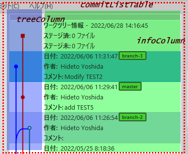
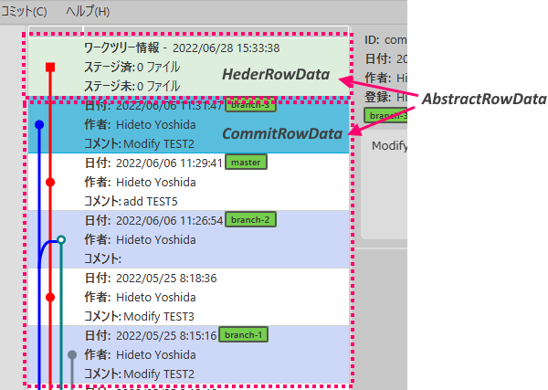

CommitList is implemented using *TableView* in JavaFX.

### Basic Structure and FXML

First, we define the view in FXML.
This table structure has a column for drawing a tree diagram and a column for displaying information about commits.

<?xml version="1.0" encoding="UTF-8"?>
<?xml version="1.0" encoding="UTF-8"?>

<?import javafx.scene.control.TableColumn?>
<?import javafx.scene.control.TableView?>
<?import javafx.scene.layout.AnchorPane?>

<TableView fx:id="commitListTable" minWidth="200.0"
           xmlns:fx="http://javafx.com/fxml/1" xmlns="http://javafx.com/javafx/10.0.2"
           AnchorPane.bottomAnchor="0.0" AnchorPane.topAnchor="0.0"
           AnchorPane.leftAnchor="0.0" AnchorPane.rightAnchor="0.0"
           stylesheets="@/Gview.css" fx:controller="gview.view.commitlist.CommitListCtrl">
  <columns>
    <TableColumn fx:id="treeColumn" editable="false" sortable="false" reorderable="false" text="" />
    <TableColumn fx:id="infoColumn" editable="false" sortable="false" reorderable="false" text="" />
  </columns>
</TableView>


### Window Class

I implemented *CommitList* form View Class with *GvBaseWindow* as the basic class.
Like *BranchList*, this is also a singleton.

package gview.view.branchlist
package gview.view.commitlist
import gview.view.framework.GvBaseWindow

object CommitList: GvBaseWindow<CommitListCtrl>("/view/CommitListView.fxml", "CommitList")


### Control Class

We have three properties in CommitListCtrl, one is for TableView, and other two are for TableColumns.

```kotlin
class CommitListCtrl: GvBaseWindowCtrl() {
    @FXML private lateinit var commitListTable: TableView<RowData>
    @FXML private lateinit var treeColumn: TableColumn<RowData, CellData>
    @FXML private lateinit var infoColumn: TableColumn<RowData, CellData>
```

<br/>

*RowData* and *CellData* are interfaces that provide data for rows and cells.
<br/>

#### RowData

*RowData* has three properties: the name when the Style is specified and *CellData* for each of the two columns.

```kotlin
    interface RowData {
        val styleClassName: String
        val treeCellValue: CellData
        val infoCellValue: CellData
    }
```

*CommitList* contains two types of lines: that shows the status of the workfile and that displays information about the commit. 
The former is located at the top of the list.  
These hold information in classes *HeaderRowData* and *CommitRowData* respectively, and both of which implements the *RowData* interface.

<br/>

```kotlin
class HeaderRowData(
    commitList: CommitListCtrl,
    val model: GvWorkFilesModel,
    val laneNumber: Int?) : AbstractRowData() {
```

```kotlin
class CommitRowData(
    private val commitList: CommitListCtrl,
    val model: GvCommit) : AbstractRowData() {
```
*AbstractRowData* is used as a place to implement definitions common to the two inherited classes.  
Currently, information specifying the size and color for the tree diagram are implemented.

package gview.view.branchlist
package gview.view.commitlist

import javafx.scene.canvas.Canvas
import javafx.scene.canvas.GraphicsContext
import javafx.scene.paint.Paint

abstract class AbstractRowData: CommitListCtrl.RowData {
    protected val markRadius = 5.0
    protected val lineWidth  = 3.0

    private val colors = arrayOf(
            "blue", "red", "teal", "slateGrey", "green", "darkMagenta", "cadetBlue",
            "darkOliveGreen", "purple", "maroon")

    fun setColor(canvas: Canvas, lane: Int): GraphicsContext {
        val gc = canvas.graphicsContext2D
        val p = Paint.valueOf(colors[lane % colors.size])
        gc.lineWidth = lineWidth
        gc.fill = p
        gc.stroke = p
        return gc
    }
}


#### CellData

*CellData* is an interface that implements the following functions

```kotlin
    interface CellData {
        fun update( ): Pair<Node?, String?>
        fun layout(tableCell: Cell)
        val contextMenu: ContextMenu?
    }
```

`update()` and `layout()` are called when row information is changed and when the table is updated (e.g. resized), respectively.  
`update()` returns the *Node* and *String* to be drawn in the cell, and `layout()` updates the display according to the cell size.

I have implemented this interface with *HeaderRowData* class for the `treeColumn`, and with *CommitRowData* class for `infoColumn`, respectively.
The table can be rendered by setting the instances of the implemented classes to the `treeCellValue` and `infoCellValue` properties of the *RowData* interface, respectively.

In the following, I used *CommitRowData* as an example to explain the implementation of table drawing.

#### Implementing Control Class

As shown in the code above, the control class GvCommitListCtrl inherits from the base class GvBaseWindowCtrl and declares variables corresponding to the elements defined in the FXML file. 
RowData and CellData interfaces are also declared in this class.

```kotlin
class CommitListCtrl: GvBaseWindowCtrl() {
    @FXML private lateinit var commitListTable: TableView<RowData>
    @FXML private lateinit var treeColumn: TableColumn<RowData, CellData>
    @FXML private lateinit var infoColumn: TableColumn<RowData, CellData>

    interface RowData {
        val styleClassName: String
        val treeCellValue: CellData
        val infoCellValue: CellData
    }

    interface CellData {
        fun update(): Pair<Node?, String?>
        fun layout(tableCell: Cell)
        val contextMenu: ContextMenu?
    }
```

Next, we define a factory class *Cell* that extends the *[TableCell](https://docs.oracle.com/javase/jp/8/javafx/api/javafx/scene/control/TableCell.html)* class.
We override the two methods `updateItem()` and `layoutChildren()` to call the corresponding methods of the *CellData* class.

```kotlin
    class Cell: TableCell<RowData, CellData>() {
        private var cellData: CellData? = null

        override fun updateItem(data: CellData?, empty: Boolean) {
            super.updateItem(data, empty)
            cellData = data
            if(data != null && !empty) {
                val( graphic, text ) = data.update()
                this.graphic = graphic
                this.text = text
            } else {
                this.graphic = null
                this.text = null
            }
            contextMenu = data?.contextMenu
        }

        override fun layoutChildren() {
            super.layoutChildren()
            cellData?.layout(this)
        }
    }
```

The factory class is set up in the `initialize()` of the control class.

```kotlin
    fun initialize() {
        commitListTable.style = "-fx-padding: 0;"
        commitListTable.placeholder = Label("")
        treeColumn.setCellValueFactory { row -> ReadOnlyObjectWrapper(row.value.treeCellValue) }
        infoColumn.setCellValueFactory { row -> ReadOnlyObjectWrapper(row.value.infoCellValue) }
        treeColumn.setCellFactory { Cell() }
        infoColumn.setCellFactory { Cell() }
```

At first, we set the CSS style and placeholders (strings that are displayed when there is no data to display)
for the *commitListTable*.

The next two lines set up the *sellValueFactory*. `row.value` is an implementation class of *RowData*, so we set expressions to get its `treeCellValue` and `infoCellValue`.

The last two lines set up an instance of the previously implemented *Cell* class as *CellFactory*.

#### Show List

Once you have reached this point, all you need to do is display the information.  

When we receive a list of commit models, expanded into a table as follows:

```kotlin
    commitListTable.items.clear()
    commitList.value.forEach {
        commitListTable.items.add(CommitRowData(this, it))
    }
```