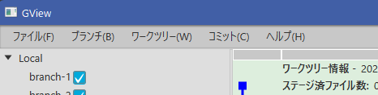

In this program, I implemented the menu, as well as the other windows, using the [Window Base Class]().

### Basic Structure and FXML 

FXML is very simple, consisting of only one *MenuBar*.

<?xml version="1.0" encoding="UTF-8"?>
<?import javafx.scene.control.MenuBar?>
<?import javafx.scene.layout.AnchorPane?>
<MenuBar xmlns="http://javafx.com/javafx" xmlns:fx="http://javafx.com/fxml"
         fx:id="menuBar" AnchorPane.leftAnchor="0.0" AnchorPane.rightAnchor="0.0"
         fx:controller="gview.view.main.MenuBarCtrl">
</MenuBar>


### Window Class

The Window Class is also very simple.

package gview.view.main
import gview.view.framework.GvBaseWindow

object MenuBar: GvBaseWindow<MenuBarCtrl>("/view/MenuBar.fxml", "MenuBar")


### Menu Item Class

Before implementing Control Class, I wrote a class to simplify the definition of a menu item.  

package gview.view.menu

import javafx.event.ActionEvent
import javafx.event.EventHandler
import javafx.scene.control.MenuItem
import javafx.scene.input.KeyCodeCombination
import org.kordamp.ikonli.javafx.FontIcon

class GvMenuItem(
    text: String,
    iconLiteral: String? = null,
    accelerator: KeyCodeCombination? = null,
    eventHandler: EventHandler<ActionEvent>
) : MenuItem(text) {

    init {
        if (iconLiteral != null) {
            var icon = FontIcon()
            icon.iconLiteral = iconLiteral
            graphic = icon
        }
        if (accelerator != null) {
            this.accelerator = accelerator
        }
        onAction = eventHandler
    }
}
 

The constructor has the following four parameters:

text
: specifies the menu text.

iconLiteral
: specifies the name of the menu icon (optional).  
  I used [Icon packs for Java applications](https://kordamp.org/ikonli/) for the menu icons.

accelerator
: specifies the accelerator (optional).

eventHandler
: Defines the process to be executed when the menu is selected.

Using this class, you can implement a menu, for example, as follows

package gview.view.menu

import javafx.event.EventHandler
import javafx.scene.control.Menu

class HelpMenu: Menu("ヘルプ(_H)") {

    private val helpMenuItem = GvMenuItem(
            text = "ヘルプ...",
            iconLiteral = "mdi-help-circle-outline"
    ) { 
      // [ヘルプ]メニュー実装
    }

    private val aboutMenuItem = GvMenuItem(
            text = "プログラムについて..."
    ) {
      // [プログラムについて]メニュー実装
    }

    init {
        items.setAll(
            helpMenuItem,
            aboutMenuItem
        )
        onShowing = EventHandler { onMyShowing() }
    }

    private fun onMyShowing() {
      // 表示開始時の処理実装
    }
}
 

Declare each menu item as instances of *GvMenuItem*, and register them by ``items.setAll()``.

``onMyShowing()`` is the place to implement where the process of enabling/disabling menu items conditionally.

### Control Class

In the menu control class, we can simply register the menu declared above.

package gview.view.main

import gview.view.framework.GvBaseWindowCtrl
import gview.view.menu.*
import javafx.fxml.FXML
import javafx.scene.control.MenuBar as JavaFxMenuBar

class MenuBarCtrl : GvBaseWindowCtrl() {
    @FXML private lateinit var menuBar: JavaFxMenuBar

    fun initialize() {
        menuBar.menus.addAll(
            FileMenu(),
            BranchMenu(),
            WorkTreeMenu(),
            CommitMenu(),
            HelpMenu()
        )
    }
}
 

