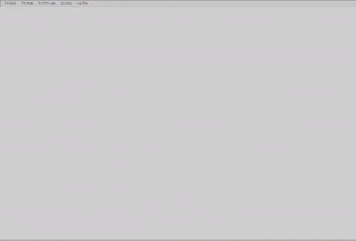

---
title: "Program Description"
linkTitle: "Program Description"
weight: 10
menu:
  main:
    weight: 10
---

{}
This section provides an overview of the gview project.
{}

*gview* is an application under development for GUI manipulation of git.

It runs on the Java Virtual Machine (JVM) and uses [JavaFX](https://openjfx.io/) for the GUI.
For git operations, I used [JGit](https://www.eclipse.org/jgit/), a Pure Java library.

I chose [kotlin](https://kotlinlang.org/) as programming language instead of Java.
In addition to kotlin programming itself, how to control JGit from kotlin and how to interface with JavaFX were also the topics.
