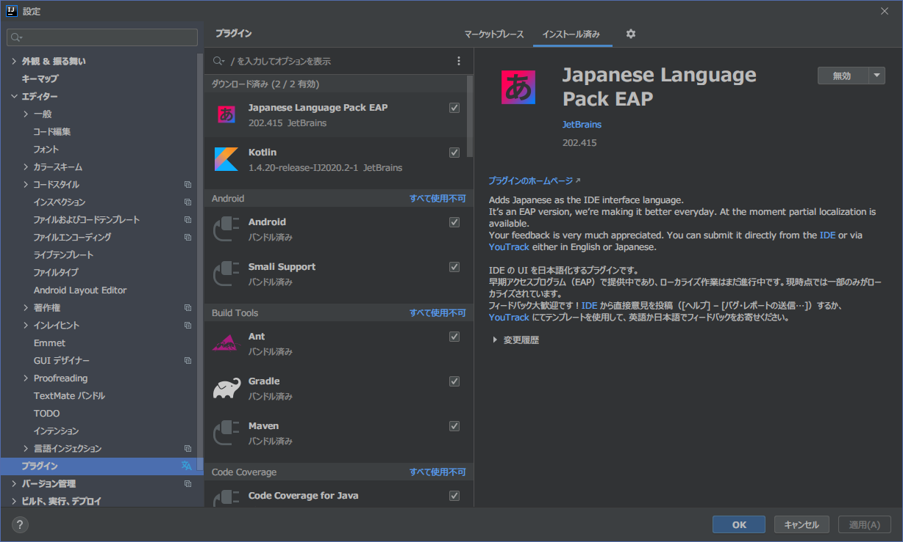

Gviewの開発では、プログラム言語として [Kotlin](https://kotlinlang.org/) を使用することにしました。

Kotlinは一般的に言うJVM言語のひとつで、Javaと互換性があります(相互呼び出しが可能です)。
GITライブラリとして、Pure Javaで記述されたライブラリであるJGitを使うつもりなので、Javaとの互換性は必須でした。
特にKotlinを選んだのは、Androidの開発などで注目されている言語を使ってみたいという、個人的な関心からです。

Kotlinでプログラムを開発する方法はいくつかありますが、
一番簡単で手っ取り早いのは、やはり [IntelliJ/IDEA](https://www.jetbrains.com/ja-jp/idea/) を使用することだと思います。
言語と同じ開発元(JetBrain)が開発するIDEなので、一番充実したサポートが期待できることと、
IDE自体の評判も高いことが理由です。
個人やオープンソース開発であれば、無償版(Community Edition)が使用できる点もメリットです。

### ダウンロード～インストール

ダウンロードはこちらから → [ダウンロード IntelliJ IDEA](https://www.jetbrains.com/ja-jp/idea/download/)  
インストール方法はOSによって違うので割愛しますが、難しい部分は特にないと思います。

{}[こちらのページ](https://pleiades.io/help/idea/installation-guide.html)に、インストールの手順がていねいに説明されています。  
探せば他にもたくさんあるでしょう。{}

### プラグイン

日本語で使用する場合、以前は別のプラグイン(pleiades)が必要でしたが、最近になって純正の [日本語プラグイン](https://plugins.jetbrains.com/plugin/13964-japanese-language-pack-eap) が入手できるようになったので、インストールしておくと便利です。

その他には、[Kotlinプラグイン](https://plugins.jetbrains.com/plugin/6954-kotlin) をインストールしておきます。ダウンロードしたIDEAのバージョンによっては、最初からインストールされているのかも知れません。

それ以外のプラグインは、デフォルトでバンドルされているものをすべて使用しました。プラグインの設定画面(「ファイル」→「設定」で「プラグイン」を選択)は、次の図のようになっています。

