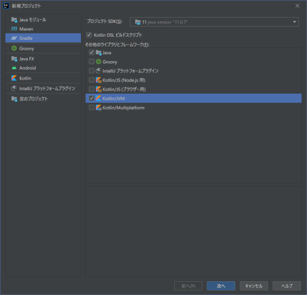
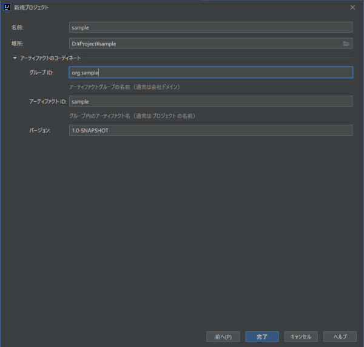
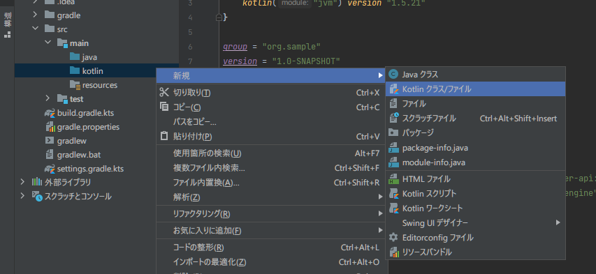
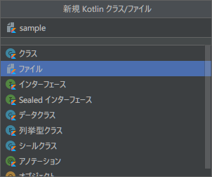
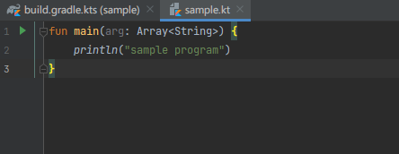

開発環境(IDE)のインストールが終了すれば、まず最初にプロジェクトを作成します。

### プロジェクトの新規作成

今回は、[Gradle](https://gradle.org/)で依存関係を管理するプロジェクトを作ることにしました。

まずはプロジェクトの新規生成メニュー([ファイル]→[新規作成]→[プロジェクト]など)で「新規プロジェクト」のダイアログを呼び出します。
「その他のライブラリとフレームワーク」では“Java”と“kotlin/jvm”を選択します。
{}ここでJavaを選択しておかないと、`src/`以下のフォルダを作ってくれないようなので、注意してください。  {}

今回は、“DSLビルドスクリプト”もkotlinで書くことにしました。

<div style="clear:both;"></div>

「次へ」を押して、適当な名前などを入力後、「完了」で最初のプロジェクトが生成されます。  

<div style="clear:both;"></div>

### 生成されたプロジェクト

生成されたプロジェクトのディレクトリ構成は、次のようになるはずです。
<blockquote><pre>
    sample/
    ├── build.gradle.kts
    ├── gradle
    │   └── wrapper
    │       ├── gradle-wrapper.jar
    │       └── gradle-wrapper.properties
    ├── gradle.properties
    ├── gradlew
    ├── gradlew.bat
    ├── settings.gradle.kts
    └── src
        ├── main
        │   ├── java
        │   ├── kotlin
        │   └── resources
        └── test
            ├── java
            ├── kotlin
            └── resources
</pre></blockquote>

簡単なコードを書いて、プロジェクト構造を確認しましょう。
まず*src/main/kotlin*下に、[新規]→[kotlinクラス/ファイル]でkotlinソースファイルを作成します。  

<div style="clear:both;"></div>

適当なファイル名を指定して、ソースファイルを生成します。  


<div style="clear:both;"></div>

[実行]メニューから実行すれば、メッセージが出力されるはずです。   
```
sample program
```