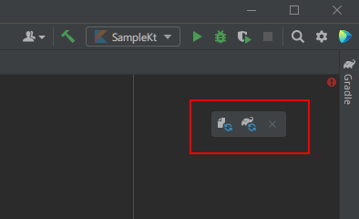
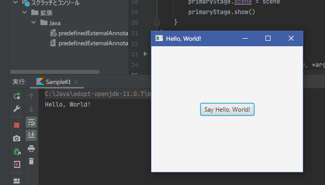

プロジェクトでJavaFXのクラスを利用できるように、パッケージなどのセットアップを行います。

### gradleの設定

前章で作成したプロジェクトは[gradle](https://gradle.org/)を使用しているので、
gradle経由でJavaFXを使用するための定義を追加します。
更新するファイルは、プロジェクト直下にある*build.gradle.kts*です。

JavaFXプラグイン/[JavaFX Gradle PlugIn](https://github.com/openjfx/javafx-gradle-plugin) を導入するために、次の記述を追加してください。 

```kotlin
plugins {
    id("org.openjfx.javafxplugin") version "0.0.9"
}
javafx {
    version = "11.0.2"
    modules = listOf("javafx.controls","javafx.fxml")
}
```

追加をすると、次のようなアイコンが表示されるので、「Gradleの変更を読み込む」を実行します。


エラーなく終了すれば、準備完了です。

更新後の*build.gradle.kts*ファイルの内容は、次のようになりました。
{}使用するIDEのバージョンによって多少の違いがあるかも知れません。{}

```kotlin
plugins {
    java
    kotlin("jvm") version "1.5.21"
    id("org.openjfx.javafxplugin") version "0.0.9"
}

group = "org.sample"
version = "1.0-SNAPSHOT"

repositories {
    mavenCentral()
}

dependencies {
    implementation(kotlin("stdlib"))
    testImplementation("org.junit.jupiter:junit-jupiter-api:5.6.0")
    testRuntimeOnly("org.junit.jupiter:junit-jupiter-engine")
}

javafx {
    version = "11.0.2"
    modules = listOf("javafx.controls","javafx.fxml")
}

tasks.getByName<Test>("test") {
    useJUnitPlatform()
}
```

### サンプルプログラム - hello, world

JavaFXを使用する準備ができたので、簡単なサンプルを作って確認してみます。  

[生成されたプロジェクト]( "生成されたプロジェクト")で作成した*sample.kt*ファイルを次のように書き換えてください。
{}*javafx*関連クラスのimportができない場合は、gradleの設定を再確認してください。{}

```kotlin
import javafx.application.Application
import javafx.event.EventHandler
import javafx.scene.Scene
import javafx.scene.control.Button
import javafx.scene.layout.StackPane
import javafx.stage.Stage

class Sample: Application() {
	override fun start(primaryStage: Stage) {
		val greet = "Hello, World!"
		val btn = Button()
		btn.text = "Say $greet"
		btn.onAction = EventHandler { println(greet) }
		val root = StackPane()
		root.children.add(btn)
		val scene = Scene(root, 300.0, 250.0)
		primaryStage.title = greet
		primaryStage.scene = scene
		primaryStage.show()
	}
}

fun main(args: Array<String>) {
	Application.launch(Sample::class.java, *args)
}
```

実行すれば、次のような画面が表示されるはずです。


