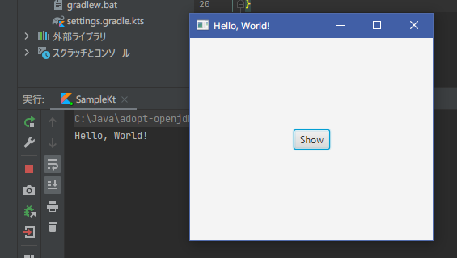

[基本設定]( "基本設定")で示したサンプルプログラムでは、
ビューの構成をJava(実際にはKotlin)で記述していました。  
“Hello, World”のような単純な画面ならばこれでよいのですが、実際にプログラムを開発する場合は、
複雑な画面構造の定義を処理コードから切り離した方が分かりやすくなります。

JavaFXにはそのための機能として、UIをXMLファイル(FXML)で記述することが可能になっています。  
詳細な説明は[こちらのチュートリアル](https://docs.oracle.com/javase/jp/8/javafx/get-started-tutorial/fxml_tutorial.htm)などを参照頂くとして、ここでは簡単なサンプルを紹介したいと思います。

まず、次のようなFXMLファイル"*Hello.fxml*"を作成して、*resources/* フォルダ下に配置します。

```kotlin
<?xml version="1.0" encoding="UTF-8"?>

<?import javafx.scene.control.*?>
<?import javafx.scene.layout.*?>

<BorderPane xmlns="http://javafx.com/javafx/11.0.2"
            xmlns:fx="http://javafx.com/fxml/1"
            fx:controller="Hello">
    <center>
        <Button fx:id="greetButton" />
    </center>
</BorderPane>
```

ここで"*fx:controller*"で指定したクラスが、このUIのコントローラになります。  
次のようなクラスを記述してください。メンバ変数"*greetButton*"は、FXMLの&lt;*Button*&gt;タグで定義したボタンに対応します。

```kotlin
import javafx.fxml.FXML
import javafx.scene.control.Button

class Hello {
	@FXML private lateinit var greetButton: Button

	fun initialize() {
		greetButton.text = "Show"
		greetButton.setOnAction { _ -> println("Hello, World!") }
	}
}
```

ビューとコントローラができましたので、
[基本設定]( "基本設定")
のサンプルプログラムの*Sample*の記述を変更して、こちらを使用するようにします。

```kotlin
import javafx.application.Application
import javafx.fxml.FXMLLoader
import javafx.scene.Parent
import javafx.scene.Scene
import javafx.stage.Stage

class Sample: Application() {

	override fun start(primaryStage: Stage) {
		val loader = FXMLLoader(javaClass.getResource("/Hello.fxml"))
		val root = loader.load() as Parent
		primaryStage.title = "Hello, World!"
		primaryStage.scene = Scene(root, 300.0, 250.0)
		primaryStage.show()
	}
}

fun main(args: Array<String>) {
	Application.launch(Sample::class.java, *args)
}
```

実行すれば、次のような画面が表示されるはずです。

