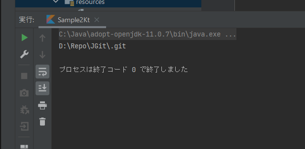

まずは、JGitを使用するための設定、アーティファクトのダウンロードなどを行います。

### Gradleの設定

JavaFXと同じく[gradle](https://gradle.org/)を使用するため、ライブラリは[Maven Repository](https://mvnrepository.com/artifact/org.eclipse.jgit/org.eclipse.jgit)から参照します。  
JavaFxの時と同じように[プロジェクトを生成]( "kotlinプロジェクトの作成 ")して、*build.gradle.kts*の*dependencies*に次の行を追加します。

```kotlin
dependencies {
    implementation("org.eclipse.jgit:org.eclipse.jgit:5.12.0.202106070339-r")
}
```

JGitはログフレームワークとして[SLF4J](https://mvnrepository.com/artifact/org.slf4j/slf4j-log4j12)を使っているので、これも同じように追加します。

```kotlin
dependencies {
    implementation("org.slf4j:slf4j-log4j12:1.7.32")
}
```

どちらもバージョンについては、それぞれのリンク先から適切なものを選んでください。

Gradleの更新を実行すれば、JGitライブラリがダウンロードされて、プログラムで使用できるようになります。

### 最初のプログラム

<a name="Sample"></a>準備ができたので、簡単なプログラムを書いて動作を確認してみましょう。

プロジェクトの*main*(ここの例では*sample.ks*になります)に、次のような、リポジトリのクローンを行うコードを書きます。*remotePath*と*locakPath*は適当なものに変更してください。

```kotlin
import org.eclipse.jgit.api.Git
import java.io.File

fun main(args: Array<String>) {

	val remotePath = "https://git.eclipse.org/r/jgit/jgit.git"
	val localPath  = "D:\\Repo\\JGit"

	val git = Git.cloneRepository()
		.setURI(remotePath)
		.setDirectory(File(localPath))
		.setBare(false)
		.call()
	println(git.repository.directory)
}
```

ビルドして実行する前にもうひとつ、log4jの設定をする必要があります。
ここでは適当に、次のファイルを*main/resources*の下に置いておきます。

```kotlin
log4j.rootLogger=ERROR, console

log4j.appender.console=org.apache.log4j.ConsoleAppender
log4j.appender.console.layout=org.apache.log4j.PatternLayout
log4j.appender.console.layout.ConversionPattern=%d [%-5p-%c] %m%n
```

ビルドして実行すれば、ローカルディレクトリにリポジトリがクローンされるはずです。

