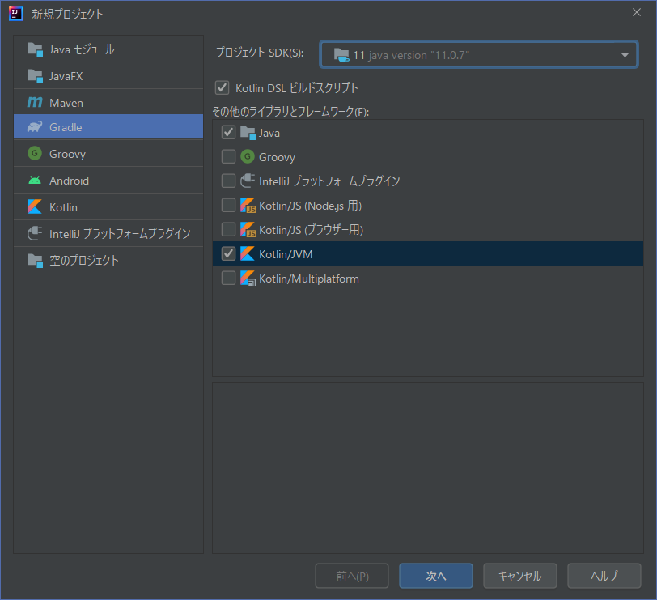
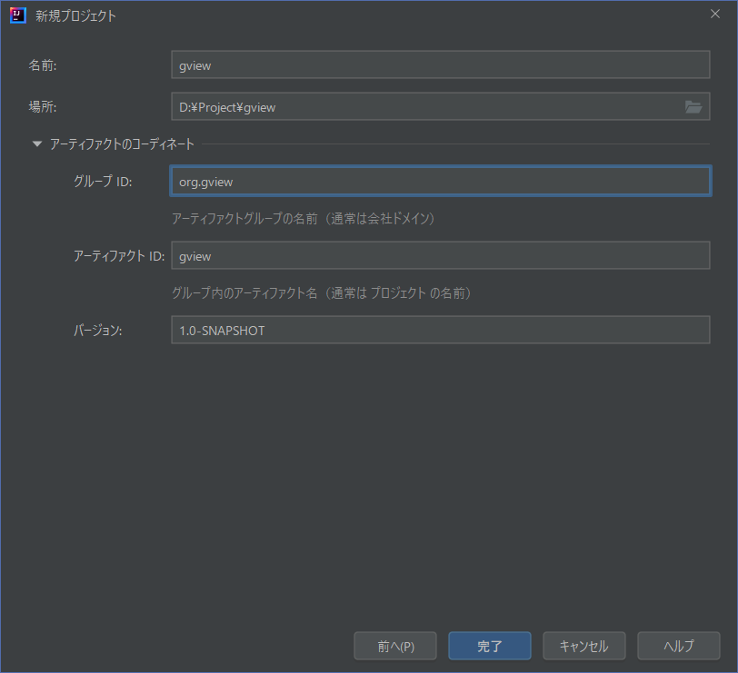

まずはプロジェクトを作成します。
これまでの説明をすべてひとつにして、JGitとJavaFXを併用できるプロジェクトを定義していきます。

サンプルでは簡単に示しましたが、ここでは手順を追って書き留めておきます。

まず、「ファイル」「新規」「プロジェクト...」メニューで、プロジェクトの新規作成ダイアログを呼び出します。



"kotlin/jvm"を選択して「次へ」で進みます。



名称など適当に入力して「完了」を選択します。

この後、しばらく時間が掛かった後、*src*ディレクトリなどが用意されたプロジェクトツリーが生成されます。

後は、*build.gradle.ks*ファイルを開いて、必要な定義を加えていきます。まず、JavaFXの利用を定義します。
```kotlin
plugins {
    id("org.openjfx.javafxplugin") version "0.0.9"
}
javafx {
    version = "11.0.2"
    modules = listOf("javafx.controls","javafx.fxml")
}
```

JGitの定義もここに加えます。
```kotlin
dependencies {
    // JGit
    implementation("org.eclipse.jgit:org.eclipse.jgit:5.9.0.202009080501-r")
    // SLF4J/Log4J
    implementation("org.slf4j:slf4j-log4j12:1.7.32")
}
```

ここでビルドすれば、必要なライブラリの取得と設定が行われて、プログラミングの準備完了です。

最終的な*build.gradle.ks*ファイルの内容は、次のようになりました。
これで、kotlinコードからJavaFXとJGitを使うプログラムが作成可能になります。  
※説明していないコンポーネントについては、別途説明します。

```kotlin
plugins {
    kotlin("jvm") version "1.6.10"
    kotlin("plugin.serialization") version "1.6.10"
    id("org.openjfx.javafxplugin") version "0.0.9"
}

group = "gview"
version = "Proto-1"

repositories { mavenCentral() }

dependencies {
    // Use the Kotlin JDK standard library.
    implementation(kotlin("stdlib"))
    implementation("org.jetbrains.kotlinx:kotlinx-serialization-json:1.3.1")
    // JGit
    implementation("org.eclipse.jgit:org.eclipse.jgit:5.9.0.202009080501-r")
    // SLF4J/Log4J
    implementation("org.slf4j:slf4j-log4j12:1.7.32")
    // Ikonli
    implementation("org.kordamp.ikonli:ikonli-javafx:12.2.0")
    implementation("org.kordamp.ikonli:ikonli-materialdesign-pack:12.2.0")
    //ControlFX
    implementation("org.controlsfx:controlsfx:11.1.1")
}

// JavaFX PlugIn
javafx {
    version = "11.0.2"
    modules = listOf("javafx.controls","javafx.fxml")
}

tasks {
    compileKotlin {
        kotlinOptions.jvmTarget = "1.8"
    }
    compileTestKotlin {
        kotlinOptions.jvmTarget = "1.8"
    }
}
```
