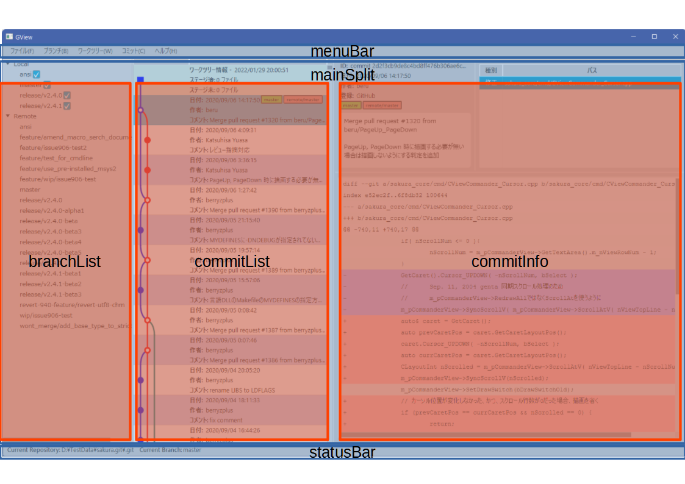

Gviewのメインウィンドウの実装について説明します。

GUIには*JavaFX*を使用していますが、このアプリケーションでは、簡単な共通クラスを作りました。
共通クラスの実装内容は[Window基本クラス]()に説明してあります。

### 基本構成とFXML

Gviewのメインウィンドウは下のような構成になっています。


画面全体は`menuBar`、`mainSplit`、`statusBar`という3つのペインで構成されています。  
`mainSplit`はさらに、`branchList`、`commitList`、`commitInfo`という3つのペインからなるスプリットウィンドウとなっています。

この構成を、以下のようなFXMLファイルで表現しました。  
*MaskerPane*は実行中表示(くるくる回るアイコン)を行うためのものです。詳細は別途説明します。

<?xml version="1.0" encoding="UTF-8"?>

<?import javafx.scene.control.*?>
<?import javafx.scene.layout.*?>

<?import org.controlsfx.control.MaskerPane?>
<StackPane
        xmlns="http://javafx.com/javafx/10.0.2" xmlns:fx="http://javafx.com/fxml/1"
        stylesheets="@/Gview.css" fx:controller="gview.view.main.MainWindowCtrl">
    <BorderPane>
        <top>
            <AnchorPane fx:id="menuBar"/>
        </top>
        <center>
            <SplitPane fx:id="mainSplit" dividerPositions="0.2, 0.5" BorderPane.alignment="CENTER">
                <AnchorPane fx:id="branchList" SplitPane.resizableWithParent="false"/>
                <AnchorPane fx:id="commitList" SplitPane.resizableWithParent="false"/>
                <AnchorPane fx:id="commitInfo"/>
            </SplitPane>
        </center>
        <bottom>
            <AnchorPane fx:id="statusBar"/>
        </bottom>
    </BorderPane>
    <MaskerPane fx:id="masker" visible="false"/>
</StackPane>


### Windowクラス

メインウィンドウのビュークラスとなる`MainWindow`クラスは、基本クラスを継承することで、簡潔に記述できます。

import gview.view.framework.GvBaseWindow

object MainWindow: GvBaseWindow<MainWindowCtrl>("/view/MainView.fxml", "MainWindow")


### コントロールクラス

コントロールクラスも基本クラスを継承します。まず最初に、FXMLファイルで定義した各Paneに対応する変数を定義します。

```kotlin
class MainWindowCtrl: GvBaseWindowCtrl() {
    @FXML private lateinit var mainSplit: SplitPane
    @FXML private lateinit var menuBar: AnchorPane
    @FXML private lateinit var branchList: AnchorPane
    @FXML private lateinit var commitList: AnchorPane
    @FXML private lateinit var commitInfo: AnchorPane
    @FXML private lateinit var statusBar: AnchorPane
    @FXML private lateinit var masker: MaskerPane
```

`initialize()`メソッドでは2つのことを行います。

まず`mainSprit`を設定します。初期値を設定した後、表示比が変更された場合に、その値を取得するためのイベント定義を追加します。  
`SystemModal`オブジェクトは、ファイルへのシリアライズ/デシリアライズをサポートしたデータ保存クラスで、前回終了時の表示比を保持すると同時に、変更時にはファイルへの永続化を行います。

```kotlin
    fun initialize() {
        mainSplit.setDividerPositions(
            SystemModal.mainSplitPos[0], SystemModal.mainSplitPos[1])
        mainSplit.dividers[0].positionProperty().addListener { _, _, value
            -> SystemModal.mainSplitPos[0] = value.toDouble() }
        mainSplit.dividers[1].positionProperty().addListener { _, _, value
            -> SystemModal.mainSplitPos[1] = value.toDouble() }

        branchList.children.add(BranchList.root)
        commitList.children.add(CommitList.root)
        commitInfo.children.add(CommitInfo.root)
        menuBar.children.add(MenuBar.root)
        statusBar.children.add(StatusBar.root)
    }
```
後半は各Paneへのウィンドウの設定を行っています。`BranchList`、`CommitList`など、それぞれのウィンドウは、`MainWindow`と同じ構造のオブジェクトになっているので、*Parent*インスタンスを参照して設定するだけで簡単にウィンドウを構成できます。

実際の処理は各Paneに実装しているので、`MainWindowCtrl`自体の処理はほとんどありません。唯一のメソッドである`runTask()`では、指定された処理を「実行中」表示、具体的には*WAIT*アイコンと`masker`を使用した処理中画面表示の裏で実行します。プログラム立ち上がり時のリポジトリオープン処理で使用しています。

```kotlin
    fun runTask(proc: () -> Unit) {
        val scene = MainWindow.root.scene
        scene.cursor = Cursor.WAIT
        val task = object: Task<Unit>() {
            override fun call() {
                try {
                    proc()
                } catch(e: Exception) {
                    Platform.runLater { ErrorDialog(e).showDialog() }
                }
                finally { Platform.runLater { scene.cursor = Cursor.DEFAULT } }
            }
        }
        masker.visibleProperty().bind(task.runningProperty())
        Thread(task).start()
    }
```

`MainWindowCtrl`の実装はここまでです。全体としては、次のようになっています。

package gview.view.main

import gview.conf.SystemModal
import gview.view.branchlist.BranchList
import gview.view.commitinfo.CommitInfo
import gview.view.commitlist.CommitList
import gview.view.dialog.ErrorDialog
import gview.view.framework.GvBaseWindowCtrl
import javafx.application.Platform
import javafx.concurrent.Task
import javafx.fxml.FXML
import javafx.scene.Cursor
import javafx.scene.control.SplitPane
import javafx.scene.layout.AnchorPane
import org.controlsfx.control.MaskerPane

class MainWindowCtrl: GvBaseWindowCtrl() {
    @FXML private lateinit var mainSplit: SplitPane
    @FXML private lateinit var menuBar: AnchorPane
    @FXML private lateinit var branchList: AnchorPane
    @FXML private lateinit var commitList: AnchorPane
    @FXML private lateinit var commitInfo: AnchorPane
    @FXML private lateinit var statusBar: AnchorPane
    @FXML private lateinit var masker: MaskerPane

    fun initialize() {
        mainSplit.setDividerPositions(
            SystemModal.mainSplitPos[0], SystemModal.mainSplitPos[1])
        mainSplit.dividers[0].positionProperty().addListener { _, _, value
            -> SystemModal.mainSplitPos[0] = value.toDouble() }
        mainSplit.dividers[1].positionProperty().addListener { _, _, value
            -> SystemModal.mainSplitPos[1] = value.toDouble() }

        branchList.children.add(BranchList.root)
        commitList.children.add(CommitList.root)
        commitInfo.children.add(CommitInfo.root)
        menuBar.children.add(MenuBar.root)
        statusBar.children.add(StatusBar.root)
    }

    fun runTask(proc: () -> Unit) {
        val scene = MainWindow.root.scene
        scene.cursor = Cursor.WAIT
        val task = object: Task<Unit>() {
            override fun call() {
                try {
                    proc()
                } catch(e: Exception) {
                    Platform.runLater { ErrorDialog(e).showDialog() }
                }
                finally { Platform.runLater { scene.cursor = Cursor.DEFAULT } }
            }
        }
        masker.visibleProperty().bind(task.runningProperty())
        Thread(task).start()
    }
}

