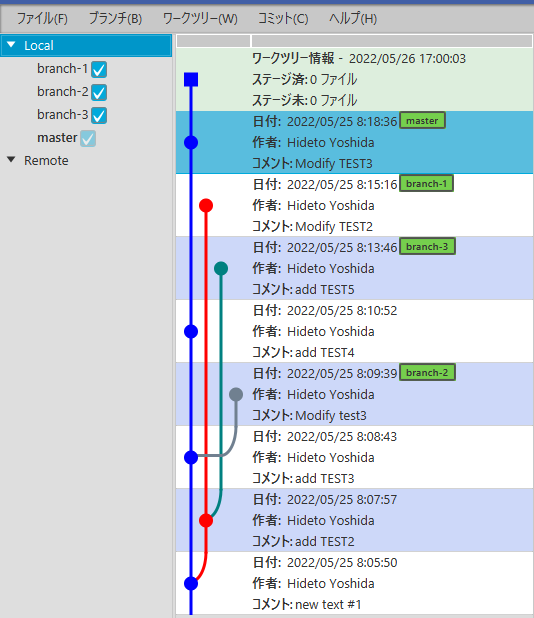
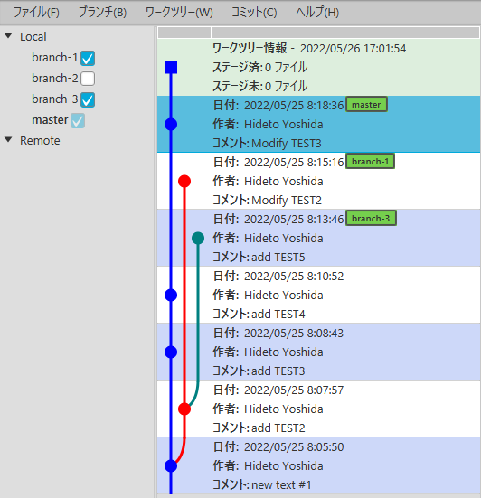
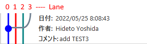

リポジトリモデル内にコミット情報のリストを保持します。

### コミット情報リストの取得

リポジトリの生成やブランチ情報の取得には、JGitの高レベルクラスである[*Git*](https://javadoc.io/doc/org.eclipse.jgit/org.eclipse.jgit/5.9.0.202009080501-r/org/eclipse/jgit/api/Git.html)を使用しましたが、
コミットに関してはもっと詳細な情報が欲しいため、もう少し低いレベルで処理を行うことにします。

JGitには[*PlotWalk*](https://javadoc.io/static/org.eclipse.jgit/org.eclipse.jgit/5.9.0.202009080501-r/org/eclipse/jgit/revplot/PlotWalk.html)というクラスがあり、単にコミットの情報だけでなく、コミットグラフを描画するための情報も取り出すことができます。

最初に*PlotWalk*のインスタンスを生成します。パラメータは、情報を参照する[*Repository*](https://javadoc.io/static/org.eclipse.jgit/org.eclipse.jgit/5.9.0.202009080501-r/org/eclipse/jgit/lib/Repository.html)です。

```kotlin
    val plotWalk = PlotWalk(repository)
```

次に、グラフのトラバーサルを開始するコミットを指定します。
開始位置は[*RevCommit*](https://javadoc.io/static/org.eclipse.jgit/org.eclipse.jgit/5.9.0.202009080501-r/org/eclipse/jgit/revwalk/RevCommit.html)のインスタンスまたはコレクションで、*parseCommit(AnyObjId)*メソッドなどを使用して取得します。

例えば“HEAD”から開始したい場合は、定数`HEAD`と*Repository*のメソッドを使って、*ObjId*を取得することができます。
```kotlin
    val headId = repository.resolve(Constants.HEAD)
    plotWalk.markStart(plotWalk.parseCommit(headId))
```

コミット情報を実際に取り出すには、コレクションクラスの[*PlotCommitList*](https://javadoc.io/static/org.eclipse.jgit/org.eclipse.jgit/5.9.0.202009080501-r/org/eclipse/jgit/revplot/PlotCommitList.html)を使用します。*source()*メソッドを使って*PlotWalk*を設定した後、*fillTo()*を呼び出して要素を取得する手順です。

```kotlin
    val plotCommitList = PlotCommitList<PlotLane>()
    plotCommitList.source(plotWalk)
    plotCommitList.fillTo(commitSize)
```

*commitSize*には取得するコミット情報の最大数を指定します。
*PlotCommitList*から取得できるのは、コミット情報 *PlotCommit\<PlotLane\>* です。

情報の取得後は、`plotWalk`をクローズしておく必要があります。
*PlotWalk*クラスは*AutoClose*を実装しているので、Kotlinの*use*を使用することも可能です。

Gviewでは、ブランチ毎に表示/非表示を選択できるようにしていますが、これは先程の*markStart()*の設定で実現しています。
表示対象(チェックボックスがON)のブランチのIDのみをトラバーサル対象に設定する仕組みです。

```kotlin
    val plotWalk = PlotWalk(repository.jgitRepository)
    val plotCommitList = PlotCommitList<PlotLane>()
    plotWalk.use {
        repository.branches.localBranchList.value
            .filter { it.selectedFlagProperty.value }
            .forEach { plotWalk.markStart(plotWalk.parseCommit(it.ref.objectId)) }
        plotCommitList.source(plotWalk)
        plotCommitList.fillTo(this.commitSize)
    }
```

例えば次のようなリポジトリで、

<br/>

"branch-2"を表示対象外にすると、次のようになります。



### コミット情報

取得したコミット情報リストに含まれるコミット情報には、コミット操作に関する情報(作者、日付、コメントなど)の他、
コミットグラフ(樹形図)を描画するための情報も含まれています。

#### コミットグラフ

*PlotWalk*を使って取得した*PlotCommit\<PlotLane\>* からは、コミットグラフを描画するための情報を取得することができます。
*PlotLane*で表されるコミットグラフ情報には"レーン"と呼ばれる、０から始まる整数値が使用されています。
グラフの最左端がレーン0に当たります。

下の図では、コミットに対してレーン0～3が定義されています。



コミットグラフを描画するには、各コミットが保有している次の情報を使用します。
1. コミット自身のレーン番号(`laneNumber`)。上図で●の表示されているレーンです。図ではレーン０になります。  
レーン番号は、*PlotLane*のフィールド*position*から参照します。
2. 通過するレーン番号(`passThroughLanes`)。上図のレーン1と2は、このコミットの前後をつなぐレーンであるため、通過する直線で表されています。
この情報は*PlotCommitList\<PlotLane\>* のメソッド*findPassingThrough(commit,result)* で取得できます。
    ```kotlin
    val passThroughLanes : MutableList<Int> by lazy {
        val result = mutableSetOf<PlotLane>()
        commitList.plotCommitList.findPassingThrough(thisCommit, result)
        result.map { it.position }.sorted().distinct().toMutableList()
    }
    ```
3. このコミットに到達するレーン番号(`enteringLanes`)。コミットの親の情報(`parents`)から取得します。
マージでない(parentsの数が１つ)の場合は自分自身のレーン番号、マージの場合は、マージ元のコミットのレーン番号を加えています。
    ```kotlin
    val enteringLanes : List<Int> by lazy {
        if(thisCommit.parentCount > 1) {
            ( parents.map { it.laneNumber } ).plus( laneNumber ).distinct()
        } else {
            listOf( laneNumber )
        }
    }
    ```
4. このコミットから出るレーン番号(`exitingLanes`)。前項 `enteringLanes` の情報を使って求めています。
ひとつ上のコミットの `passThroughLanes` と `enteringLanes` の和から、このコミットの `passThroughLanes` を除いたものが
このコミットから出るレーンになります。
    ```kotlin
    val exitingLanes: MutableList<Int> by lazy {
        (prevCommit?.enteringLanes?.plus(prevCommit.passThroughLanes)?.minus(passThroughLanes.toSet())
            ?: emptyList()).toMutableList()
    }
    ```

#### コミット情報クラス

コミット情報リストで取得した*PlotCommit\<PlotLane\>*と、前述したコミットグラフ情報を持ったコミット情報クラスを生成します。
以下のようなパラメータをコンストラクタに持つことで、生成時に双方向参照が可能なリストを作るようにします。

```kotlin
class GvCommit(private val repo: Repository,
               private val thisCommit: PlotCommit<PlotLane>,
               private val commitList: GvCommitList,
               private val prevCommit: GvCommit?) {
    private var nextCommit: GvCommit? = null
    init {
        prevCommit?.nextCommit = this
    }
```

先程生成した*PlotCommitList<PlotLane>*から、このコミット情報クラスのリストを作ります。

```kotlin
        val commits = mutableListOf<GvCommit>()
        var prev: GvCommit? = null
        plotCommitList.forEach {
            val commit = GvCommit(repository.jgitRepository, it, this, prev)
            commits.add( commit )
            prev = commit
        }
```

ここまでで、コミット情報が取得できました。
