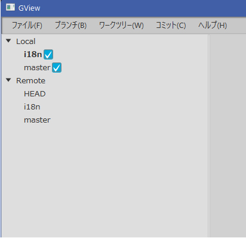

BranchListは、"Local"と"Remote"という2つのルートを持った*TreeView*で実装しています。

<br/>

実装には[Window基本クラス]()で紹介した共通クラスを使用します。

### 基本構成とFXML

まず、FXMLでビューの定義を行います。ビュー自体は*TreeView*のみの単純な構造です。

<?xml version="1.0" encoding="UTF-8"?>

<?import javafx.scene.control.TreeView?>
<?import javafx.scene.layout.AnchorPane?>

<TreeView fx:id="branchTree"
          xmlns="http://javafx.com/javafx/10.0.2" xmlns:fx="http://javafx.com/fxml/1"
          AnchorPane.bottomAnchor="0.0" AnchorPane.topAnchor="0.0"
          AnchorPane.leftAnchor="0.0" AnchorPane.rightAnchor="0.0"
          stylesheets="@/Gview.css" fx:controller="gview.view.branchlist.BranchListCtrl" />


### Windowクラス

fxmlファイルを参照するビュークラス*BranchList*をシングルトンとして定義します。
コンストラクタの2つ目のパラメータは、CSS定義を参照する時のクラス名として使用されます。

package gview.view.branchlist

import gview.view.framework.GvBaseWindow

object BranchList: GvBaseWindow<BranchListCtrl>("/view/BranchListView.fxml", "BranchList")


### コントロールクラス

コントロールクラスでは、FXMLファイルで定義したコンポーネントに対するメンバ変数を定義します。  
定義されているのは*TreeView*のインスタンスがひとつだけです。

```kotlin
class BranchListCtrl: GvBaseWindowCtrl() {
    @FXML private lateinit var branchTree: TreeView<GvBranch>

    private var localTreeRoot = RootItem("Local")
    private var remoteTreeRoot = RootItem("Remote")
```

`localTreeRoot`と`remoteTreeRoot`は、それぞれローカルブランチとリモートブランチのツリーの
ルート要素を保持するメンバで、*RootItem*クラスのインスタンスです。

*RootItem*クラスは次のように、JavaFXの*TreeView*の要素クラスである*TreeItem*を継承した
抽象クラス*BranchTreeItem*の具象クラスのひとつです。

```kotlin
    abstract class BranchTreeItem(model: GvBranch?) : TreeItem<GvBranch>(model) {
        abstract val cellImage: Node
        abstract val contextMenu: ContextMenu?
        abstract override fun isLeaf(): Boolean
    }

    class RootItem(name: String) : BranchTreeItem(null) {
        override val cellImage: Node = Label(name)
        override val contextMenu: ContextMenu? = null
        override fun isLeaf(): Boolean = false
        init { isExpanded = true }
    }
```

*BranchTreeItem*は*TreeItem*の抽象メソッドである`isLeaf()`の他、
セルへの描画イメージを保持する`cellImage`と、右クリック時に表示するコンテキストを返す`contextmenu`という、
2つの抽象プロパティを持っています。

*RootItem*クラスはLeafではないので`isLeaf()`は`false`を返します。
コンテキストメニューも使用しないので`contextMenu`は`null`、`cellImage`は名称を表示する単純なラベルを返すようにしています。

表示の初期化は、JavaFXの作法に従って`initialize()`メソッドとして実装します。
まず最初に、`TreeView`全体のルートとなる要素を宣言し、`localTreeRoot`と`remoteTreeRoot`をその子供として
登録します。このルート要素は、後で`isShowRoot`プロパティを`false`にすることで、表示しないようにしています。

```kotlin
    fun initialize() {
        val root = RootItem("Branch Root" )
        root.children.setAll(localTreeRoot, remoteTreeRoot)
```

続いて`TreeView`の初期化をします。
ルートを設定し、CellFactoryを設定した後、項目選択のクリアとCSSスタイル定義を行っています。

```kotlin
        branchTree.root = root
        branchTree.isShowRoot = false
        branchTree.setCellFactory { BranchTreeCell() }
        branchTree.selectionModel.clearSelection()
        branchTree.style = Style.treeStyle
```

CellFactoryにセットするクラス*BranchTreeCell*は、JavaFXの*TreeCell*クラスを継承した内部クラスで、
*updateItem()*メソッドをオーバーライドすることで、*treeItem*プロパティを*BranchTreeItem*具象クラスとして
参照し、表示やコンテキストメニューの更新を行っています。

```kotlin
    private class BranchTreeCell: TreeCell<GvBranch>() {
        override fun updateItem(model: GvBranch?, empty: Boolean) {
            super.updateItem(model, empty)
            if(!empty) {
                graphic = (treeItem as? BranchTreeItem)?.cellImage
                contextMenu = (treeItem as? BranchTreeItem)?.contextMenu
            } else {
                graphic = null
                contextMenu = null
            }
            text = null
            style = Style.cellStyle
        }
    }
```

`initialize()`メソッドではこの後、リポジトリ更新時とフォーカスを失った時の処理を定義した上で、
初期状態として非表示(`isVisible`に`false`)を設定しています。

```kotlin
        GvRepository.currentRepositoryProperty.addListener { _, _, repository
            -> Platform.runLater { updateRepository(repository) }
        }
        branchTree.focusedProperty().addListener { _, _, newValue ->
            if(!newValue) branchTree.selectionModel.clearSelection() }
        branchTree.isVisible = false
    }
```

*TreeView*と*TreeCell*のスタイルとして設定している定義は、以下のように定数として
クラス内に保持することにしました。

```kotlin
    private object Style {
        val treeStyle =
            "-fx-padding: 0;"
        val cellStyle =
            "-fx-padding: 2 0;"
    }
```

最後は、リポジトリ更新時の処理メソッド`updateRepository()`です。
以下のように、ローカルブランチ、リモートブランチ、選択中のブランチが更新された場合の処理を定義した上で、ローカルブランチとリモートブランチの表示更新を行っています。

```kotlin
    private fun updateRepository(repository: GvRepository) {
        val branchList = repository.branches
        branchList.localBranchList.addListener  { _ -> updateLocalBranches (branchList) }
        branchList.remoteBranchList.addListener { _ -> updateRemoteBranches(branchList) }
        branchList.currentBranch.addListener    { _ -> updateLocalBranches (branchList) }
        updateLocalBranches (branchList)
        updateRemoteBranches(branchList)
        branchTree.selectionModel.clearSelection()
    }
```

The local and remote branches are updated by traversing the respective lists and generating tree elements, as follows:

```kotlin
    private fun updateLocalBranches(branchList: GvBranchList) {
        localTreeRoot.children.clear()
        branchList.localBranchList.value.forEach { 
            localTreeRoot.children.add(LocalBranchItem(it)) }
        branchTree.isVisible = true
    }
    private fun updateRemoteBranches(branchList: GvBranchList) {
        remoteTreeRoot.children.clear()
        branchList.remoteBranchList.value.forEach { 
            remoteTreeRoot.children.add(RemoteBranchItem(it)) }
        branchTree.isVisible = true
    }
```

ツリー要素として追加している*LocalBranchItem*と*RemoteBranchItem*は
いずれも前述の*BranchTreeItem*の具象クラスです。詳細は後述します。

コントロールクラスの実装は、以下のようなものになりました。

package gview.view.branchlist

import gview.view.framework.GvBaseWindowCtrl
import gview.model.GvRepository
import gview.model.branch.GvBranch
import gview.model.branch.GvBranchList
import javafx.application.Platform
import javafx.fxml.FXML
import javafx.scene.Node
import javafx.scene.control.*

class BranchListCtrl: GvBaseWindowCtrl() {

    @FXML private lateinit var branchTree: TreeView<GvBranch>
    private var localTreeRoot = RootItem("Local")
    private var remoteTreeRoot = RootItem("Remote")

    fun initialize() {
        val root = RootItem("Branch Root" )
        root.children.setAll(localTreeRoot, remoteTreeRoot)

        branchTree.root = root
        branchTree.isShowRoot = false
        branchTree.setCellFactory { BranchTreeCell() }
        branchTree.selectionModel.clearSelection()
        branchTree.style = Style.treeStyle

        GvRepository.currentRepositoryProperty.addListener { _, _, repository
            -> Platform.runLater { updateRepository(repository) }
        }
        branchTree.focusedProperty().addListener { _, _, newValue ->
            if(!newValue) branchTree.selectionModel.clearSelection() }

        branchTree.isVisible = false
    }

    private fun updateRepository(repository: GvRepository) {
        val branchList = repository.branches
        branchList.localBranchList.addListener  { _ -> updateLocalBranches (branchList) }
        branchList.remoteBranchList.addListener { _ -> updateRemoteBranches(branchList) }
        branchList.currentBranch.addListener    { _ -> updateLocalBranches (branchList) }
        updateLocalBranches (branchList)
        updateRemoteBranches(branchList)
        branchTree.selectionModel.clearSelection()
    }

    private class BranchTreeCell: TreeCell<GvBranch>() {

        override fun updateItem(model: GvBranch?, empty: Boolean) {
            super.updateItem(model, empty)
            if(!empty) {
                graphic = (treeItem as? BranchTreeItem)?.cellImage
                contextMenu = (treeItem as? BranchTreeItem)?.contextMenu
            } else {
                graphic = null
                contextMenu = null
            }
            text = null
            style = Style.cellStyle
        }
    }

    private fun updateLocalBranches(branchList: GvBranchList) {
        localTreeRoot.children.clear()
        branchList.localBranchList.value.forEach { localTreeRoot.children.add(LocalBranchItem(it)) }
        branchTree.isVisible = true
    }

    private fun updateRemoteBranches(branchList: GvBranchList) {
        remoteTreeRoot.children.clear()
        branchList.remoteBranchList.value.forEach { remoteTreeRoot.children.add(RemoteBranchItem(it)) }
        branchTree.isVisible = true
    }

    abstract class BranchTreeItem(model: GvBranch?) : TreeItem<GvBranch>(model) {
        abstract val cellImage: Node
        abstract val contextMenu: ContextMenu?
        abstract override fun isLeaf(): Boolean
    }

    class RootItem(name: String) : BranchTreeItem(null) {
        override val cellImage: Node = Label(name)
        override val contextMenu: ContextMenu? = null
        override fun isLeaf(): Boolean = false
        init { isExpanded = true }
    }

    private object Style {
        val treeStyle =
            "-fx-padding: 0;"
        val cellStyle =
            "-fx-padding: 2 0;"
    }
}


### RemoteBranchItem

リモートブランチ情報を表示する*RemoteBranchItem*は、*RootItem*とほぼ同じで、ブランチ名のみをラベルとして持っています。

package gview.view.branchlist

import gview.view.menu.RemoteBranchContextMenu
import gview.model.branch.GvRemoteBranch
import javafx.scene.control.ContextMenu
import javafx.scene.control.Label

class RemoteBranchItem(val model: GvRemoteBranch) : BranchListCtrl.BranchTreeItem(model) {
    override val cellImage = Label(model.name)
    override fun isLeaf(): Boolean = true
    override val contextMenu: ContextMenu? get()  { return RemoteBranchContextMenu(model) }
}


### LocalBranchItem

ローカルブランチ情報を表示する*LocalBranchItem*は、ブランチ名に加えて、該当するブランチをツリー表示の対象にするかどうかを選択するチェックボックスを持っています。

まず*cellImage*には、ラベルとチェックボックスを並べて表示するように設定します。

```kotlin
    private  val branchName = Label(model.name)
    private  val showInTree = CheckBox()
    override val cellImage: Node = HBox(branchName, showInTree)
```

初期化では、ブランチが現在選択中である場合の強調表示、ラベルとチェックボックスの初期値の設定、チェックボックスが操作された場合のモデル更新処理を実装しています。

```kotlin
    init {
        if(model.isCurrentBranch) {
            branchName.style = Style.currentBranchLabelStyle
            showInTree.isSelected = true
        }
        showInTree.style = Style.checkBoxStyle
        showInTree.isSelected = model.selectedFlagProperty.value
        showInTree.selectedProperty().addListener {
                _, _, newVal -> model.selectedFlagProperty.set(newVal) }
    }
```

スタイル定義を加えたクラス全体の実装は、次のようになりました。

package gview.view.branchlist

import gview.view.menu.LocalBranchContextMenu
import gview.model.branch.GvLocalBranch
import javafx.scene.Node
import javafx.scene.control.*
import javafx.scene.layout.HBox

class LocalBranchItem(val model: GvLocalBranch) : BranchListCtrl.BranchTreeItem(model) {
    private  val branchName = Label(model.name)
    private  val showInTree = CheckBox()
    override val cellImage: Node = HBox(branchName, showInTree)
    override fun isLeaf(): Boolean = true
    override val contextMenu: ContextMenu? get()  { return LocalBranchContextMenu(model) }

    init {
        if(model.isCurrentBranch) {
            branchName.style = Style.currentBranchLabelStyle
            showInTree.isSelected = true
        }
        showInTree.style = Style.checkBoxStyle
        showInTree.isSelected = model.selectedFlagProperty.value
        showInTree.selectedProperty().addListener {
                _, _, newVal -> model.selectedFlagProperty.set(newVal) }
    }

    private object Style {
        val currentBranchLabelStyle =
            "-fx-font-weight: bold;"
        val checkBoxStyle =
            "-fx-padding: 0 0 0 2;"
    }
}
