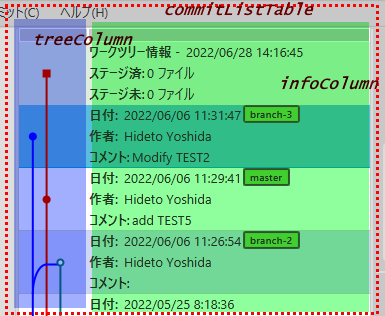
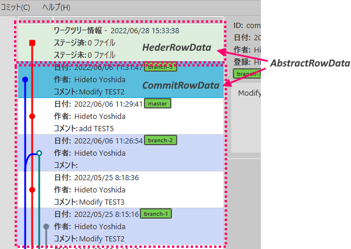

CommitListはJavaFXの*TableView*を使用して実装しています。

### 基本構成とFXML

FXMLでビューの定義を行います。
樹形図を描画するカラムと、コミットに関する情報を表示するカラムを持ったテーブル構成です。

<?xml version="1.0" encoding="UTF-8"?>
<?xml version="1.0" encoding="UTF-8"?>

<?import javafx.scene.control.TableColumn?>
<?import javafx.scene.control.TableView?>
<?import javafx.scene.layout.AnchorPane?>

<TableView fx:id="commitListTable" minWidth="200.0"
           xmlns:fx="http://javafx.com/fxml/1" xmlns="http://javafx.com/javafx/10.0.2"
           AnchorPane.bottomAnchor="0.0" AnchorPane.topAnchor="0.0"
           AnchorPane.leftAnchor="0.0" AnchorPane.rightAnchor="0.0"
           stylesheets="@/Gview.css" fx:controller="gview.view.commitlist.CommitListCtrl">
  <columns>
    <TableColumn fx:id="treeColumn" editable="false" sortable="false" reorderable="false" text="" />
    <TableColumn fx:id="infoColumn" editable="false" sortable="false" reorderable="false" text="" />
  </columns>
</TableView>


### Windowクラス

ビュークラス*CommitList*を、共通ベースクラスを使って定義します。
*BranchList*と同じく、こちらもシングルトンです。

package gview.view.branchlist
package gview.view.commitlist
import gview.view.framework.GvBaseWindow

object CommitList: GvBaseWindow<CommitListCtrl>("/view/CommitListView.fxml", "CommitList")


### コントロールクラス

コントロールクラスには、テーブルビューと2つのカラムに対するメンバ変数を定義します。

```kotlin
class CommitListCtrl: GvBaseWindowCtrl() {
    @FXML private lateinit var commitListTable: TableView<RowData>
    @FXML private lateinit var treeColumn: TableColumn<RowData, CellData>
    @FXML private lateinit var infoColumn: TableColumn<RowData, CellData>
```

`commitListTable`がテーブルビュー、`treeColumn`と`infoColumn`がそれぞれ、
樹形図を描画するカラムとコミットに関する情報を表示するカラムになります。

<br/>

*RowData*および*CellData*は、行およびセル単位のデータを提供するインターフェースです。

#### RowData

*RowData*は、Style指定時の名称と、2カラムそれぞれの*CellData*という3つのプロパティを持っています。

```kotlin
    interface RowData {
        val styleClassName: String
        val treeCellValue: CellData
        val infoCellValue: CellData
    }
```

*CommitList*には「ワークファイルの状態を表す行」と「コミットに関する情報を表示する行」の２つがあり、
ワークファイル行がリストの先頭に位置しています。これらはそれぞれ、*HeaderRowData*と*CommitRowData*
というクラスで情報を保持していて、どちらも抽象クラス*AbstractRowData*経由で先程の*RowData*
インターフェースを実装しています。

<br/>

```kotlin
class HeaderRowData(
    commitList: CommitListCtrl,
    val model: GvWorkFilesModel,
    val laneNumber: Int?) : AbstractRowData() {
```

```kotlin
class CommitRowData(
    private val commitList: CommitListCtrl,
    val model: GvCommit) : AbstractRowData() {
```
*AbstractRowData*は、2つの継承クラスに共通する定義の実装場所としています。
現時点では、樹形図のサイズと色を指定する情報が実装されています。

package gview.view.branchlist
package gview.view.commitlist

import javafx.scene.canvas.Canvas
import javafx.scene.canvas.GraphicsContext
import javafx.scene.paint.Paint

abstract class AbstractRowData: CommitListCtrl.RowData {
    protected val markRadius = 5.0
    protected val lineWidth  = 3.0

    private val colors = arrayOf(
            "blue", "red", "teal", "slateGrey", "green", "darkMagenta", "cadetBlue",
            "darkOliveGreen", "purple", "maroon")

    fun setColor(canvas: Canvas, lane: Int): GraphicsContext {
        val gc = canvas.graphicsContext2D
        val p = Paint.valueOf(colors[lane % colors.size])
        gc.lineWidth = lineWidth
        gc.fill = p
        gc.stroke = p
        return gc
    }
}


#### CellData

*CellData*は次のような関数を実装するインターフェースです。

```kotlin
    interface CellData {
        fun update( ): Pair<Node?, String?>
        fun layout(tableCell: Cell)
        val contextMenu: ContextMenu?
    }
```

`update()`と`layout()`は、それぞれ行情報の変更時とテーブルの更新時(サイズ変更など)に呼び出されます。  
`update()`はセル内に描画される*Node*と文字列*String*を返します。
`layout()`では、セルのサイズの従った表示の更新を行います。

このインターフェースを実装するクラスを*HeaderRowData*、*CommitRowData*それぞれの`treeColumn`と`infoColumn`用に実装します。
実装したクラスのインスタンスを*RowData*インターフェースの`treeCellValue`および`infoCellValue`各プロパティに設定することで、
テーブルの描画が可能になります。

以下では*CommitRowData*を例にして、テーブル描画の実装を説明したいと思います。

#### コントロールクラスの実装

先程コードを示したように、コントロールクラス*GvCommitListCtrl*は基本クラス*GvBaseWindowCtrl*を継承した上で、
FXMLファイルで定義された要素に対応する変数を宣言しています。*RowData*、*CellData*インターフェースもこのクラス内
で宣言します。

```kotlin
class CommitListCtrl: GvBaseWindowCtrl() {
    @FXML private lateinit var commitListTable: TableView<RowData>
    @FXML private lateinit var treeColumn: TableColumn<RowData, CellData>
    @FXML private lateinit var infoColumn: TableColumn<RowData, CellData>

    interface RowData {
        val styleClassName: String
        val treeCellValue: CellData
        val infoCellValue: CellData
    }

    interface CellData {
        fun update(): Pair<Node?, String?>
        fun layout(tableCell: Cell)
        val contextMenu: ContextMenu?
    }
```

次に、*[TableCell](https://docs.oracle.com/javase/jp/8/javafx/api/javafx/scene/control/TableCell.html)*クラスを継承した
ファクトリクラス*Cell*を定義します。  
*Cell*内では、`updateItem()`と`layoutChildren()`の2メソッドをオーバーライドして、*CellData*クラスの対応メソッドを
呼び出せるようにしています。

```kotlin
    class Cell: TableCell<RowData, CellData>() {
        private var cellData: CellData? = null

        override fun updateItem(data: CellData?, empty: Boolean) {
            super.updateItem(data, empty)
            cellData = data
            if(data != null && !empty) {
                val( graphic, text ) = data.update()
                this.graphic = graphic
                this.text = text
            } else {
                this.graphic = null
                this.text = null
            }
            contextMenu = data?.contextMenu
        }

        override fun layoutChildren() {
            super.layoutChildren()
            cellData?.layout(this)
        }
    }
```

ファクトリクラスの設定は、コントロールクラスの`initialize()`内で行います。

```kotlin
    fun initialize() {
        commitListTable.style = "-fx-padding: 0;"
        commitListTable.placeholder = Label("")
        treeColumn.setCellValueFactory { row -> ReadOnlyObjectWrapper(row.value.treeCellValue) }
        infoColumn.setCellValueFactory { row -> ReadOnlyObjectWrapper(row.value.infoCellValue) }
        treeColumn.setCellFactory { Cell() }
        infoColumn.setCellFactory { Cell() }
```

最初に*commitListTable*のCSSスタイルとプレースホルダ(表示データがない場合に表示される文字列)を設定しています。

次の2行は、*sellValueFactory*の設定です。引数*row*に対して、`row.value`は*RowData*の実装クラスなので、
その`treeCellValue`と`infoCellValue`を取得する式を設定します。

リストの最後の2行では、*CellFactory*として先に実装した*Cell*クラスのインスタンスを設定しています。

#### リスト表示

ここまで来れば、あとは情報を表示するだけです。  

コミットモデルの一覧を取得して、以下のようにテーブルに展開します。

```kotlin
    commitListTable.items.clear()
    commitList.value.forEach {
        commitListTable.items.add(CommitRowData(this, it))
    }
```