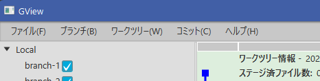

このプログラムでは、メニューも他のウィンドウと同じように、[Window基本クラス]()
を使用して実装しました。

### 基本構成とFXML 

FXMLは*MenuBar*だけの簡単なものです。

<?xml version="1.0" encoding="UTF-8"?>
<?import javafx.scene.control.MenuBar?>
<?import javafx.scene.layout.AnchorPane?>
<MenuBar xmlns="http://javafx.com/javafx" xmlns:fx="http://javafx.com/fxml"
         fx:id="menuBar" AnchorPane.leftAnchor="0.0" AnchorPane.rightAnchor="0.0"
         fx:controller="gview.view.main.MenuBarCtrl">
</MenuBar>


### Windowクラス

Windowクラスも単純です。

package gview.view.main
import gview.view.framework.GvBaseWindow

object MenuBar: GvBaseWindow<MenuBarCtrl>("/view/MenuBar.fxml", "MenuBar")


### メニュー項目クラス

コントロールクラスを実装する前に、メニュー項目の定義を簡易にするためのクラスを作成しました。  
package gview.view.menu

import javafx.event.ActionEvent
import javafx.event.EventHandler
import javafx.scene.control.MenuItem
import javafx.scene.input.KeyCodeCombination
import org.kordamp.ikonli.javafx.FontIcon

class GvMenuItem(
    text: String,
    iconLiteral: String? = null,
    accelerator: KeyCodeCombination? = null,
    eventHandler: EventHandler<ActionEvent>
) : MenuItem(text) {

    init {
        if (iconLiteral != null) {
            var icon = FontIcon()
            icon.iconLiteral = iconLiteral
            graphic = icon
        }
        if (accelerator != null) {
            this.accelerator = accelerator
        }
        onAction = eventHandler
    }
}
 

コンストラクタには以下のパラメータを指定します。

text
: メニュー表示する文字列を指定します。

iconLiteral
: メニューアイコンの名称を指定します。省略可能です。  
アイコンは[Icon packs for Java applications](https://kordamp.org/ikonli/)を使用しています。

accelerator
: アクセラレータを指定します。省略可能です。

eventHandler
: メニュー選択時に実行される処理を定義します。

このクラスを使用して、例えば次のようにメニューを実装します。

package gview.view.menu

import javafx.event.EventHandler
import javafx.scene.control.Menu

class HelpMenu: Menu("ヘルプ(_H)") {

    private val helpMenuItem = GvMenuItem(
            text = "ヘルプ...",
            iconLiteral = "mdi-help-circle-outline"
    ) { 
      // [ヘルプ]メニュー実装
    }

    private val aboutMenuItem = GvMenuItem(
            text = "プログラムについて..."
    ) {
      // [プログラムについて]メニュー実装
    }

    init {
        items.setAll(
            helpMenuItem,
            aboutMenuItem
        )
        onShowing = EventHandler { onMyShowing() }
    }

    private fun onMyShowing() {
      // 表示開始時の処理実装
    }
}
 

メニューの各項目を*GvMenuItem*のインスタンスとして宣言して、初期化時に``items.setAll()``メソッドで
登録します。  
``onMyShowing()``は、メニュー項目を条件対応で有効/無効にする処理の実装場所になります。

### コントロールクラス

メニューのコントロールクラスでは、上のように宣言したメニューを登録するだけです。

package gview.view.main

import gview.view.framework.GvBaseWindowCtrl
import gview.view.menu.*
import javafx.fxml.FXML
import javafx.scene.control.MenuBar as JavaFxMenuBar

class MenuBarCtrl : GvBaseWindowCtrl() {
    @FXML private lateinit var menuBar: JavaFxMenuBar

    fun initialize() {
        menuBar.menus.addAll(
            FileMenu(),
            BranchMenu(),
            WorkTreeMenu(),
            CommitMenu(),
            HelpMenu()
        )
    }
}
 

