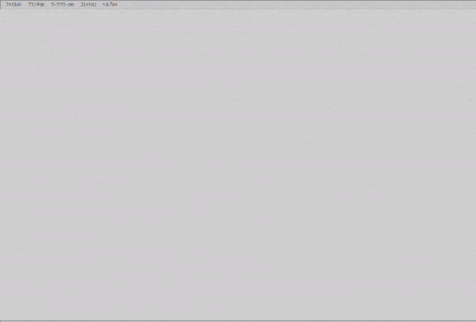

---
title: "プログラム解説"
linkTitle: "プログラム解説"
weight: 10
menu:
  main:
    weight: 10
---

{}
gviewプロジェクトの概要について説明します。
{}

*gview*はgitをGUI操作するために開発中のアプリケーションです。

プログラムはJava仮想マシン(JVM)上で動作し、GUIには[JavaFX](https://openjfx.io/)を使用しています。  
git操作にはPure Javaライブラリである[JGit](https://www.eclipse.org/jgit/)を採用しました。

言語はJavaではなく[kotlin](https://kotlinlang.org/)を選択しました。
kotlinによるプログラミング自体に加えて、kotlinからJGitをどうやって操作するか、JavaFXとはどうやって
インターフェースを取るか、といったこともテーマです。

